# 任务一. 电流镜
## 任务1.1：参考书本结合DC工作点计算和电流仿真结果，分析两者是否吻合
见图：
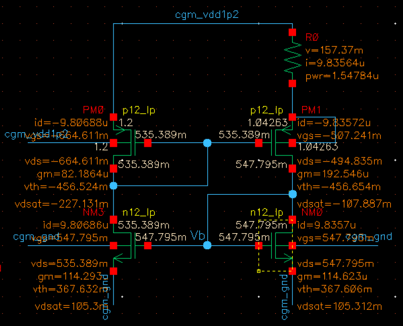

| MOSFET | $V_{GS}$/mV | $V_{DS}$/mV | $I_{DS}$/$\mu$A | $V_{\text{TH}}$/mV |  $V_{\text{DSAT}}$/mV | 
| --- | --- | --- | --- | --- | --- |
| M1 | 547.795 | 535.389 | 9.807 | 367.632 | 105.3 |
| M2 | 547.785 | 547.795 | 9.836 | 367.606 | 105.312 | 
| M3 | -507.241 | -494.835 | -9.836 | -456.654 | -107.887 | 
| M4 | -664.611 | -664.611 | -9.807 | -456.524 | -227.131 |

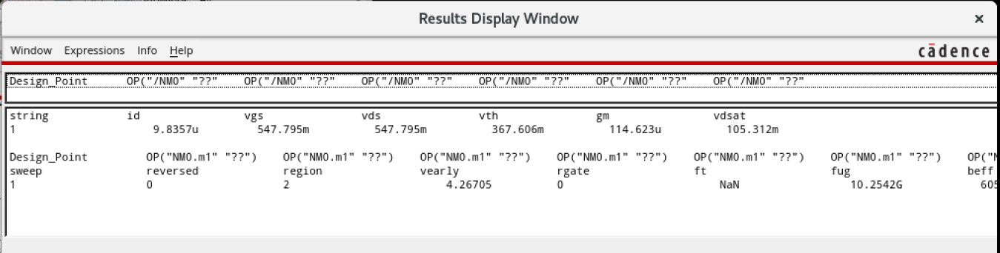
分析：（待补充）

## 任务1.2 通过DC 仿真，设置$V_{\text{DD}}$ 为变化量，得出$V_{\text{DD}}$与电流的关系，并绘图。 
$I_{\text{out}} - V_{\text{DD}}$曲线如图:
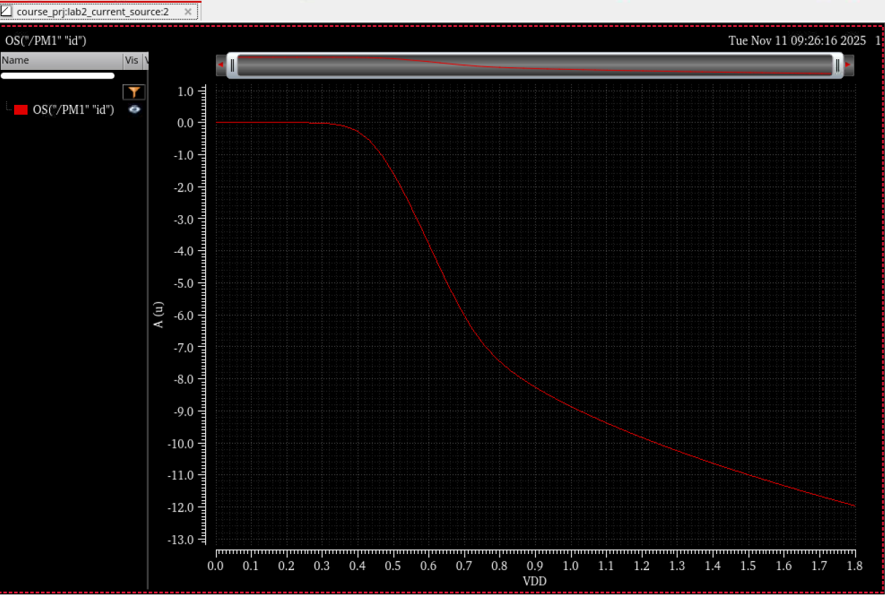

## 任务1.3 通过DC 仿真，设置温度为变化量（温度仿真设置0℃-70℃），得出温度与电流的关系，并绘图。温度扫描方法见第三部分。
$I_{\text{out}} - T$曲线如图:
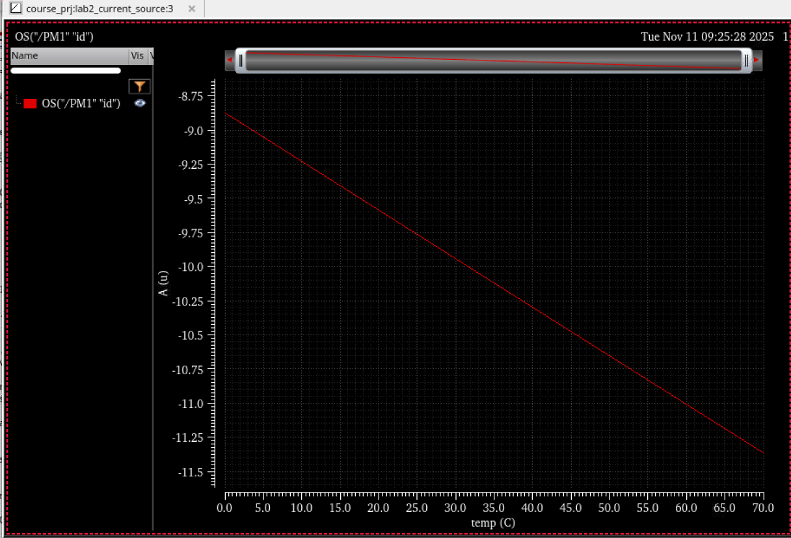

## 任务1.4：设置工艺角（TT/FF/SS）重复2/3，并绘图。Corner设置方法见第四部分
电流-$V_{\text{DD}}$曲线如图：
可以发现，当$V_{\text{DD}}<0.9V$时，ff工艺角的$I_{\text{out}}$最大，ss工艺角的$I_{\text{out}}$最小。当$V_{\text{DD}} > 0.9V$时，ff工艺角的$I_{\text{out}}$最小，tt工艺角和ss工艺角的$I_{\text{out}}$几乎相同。
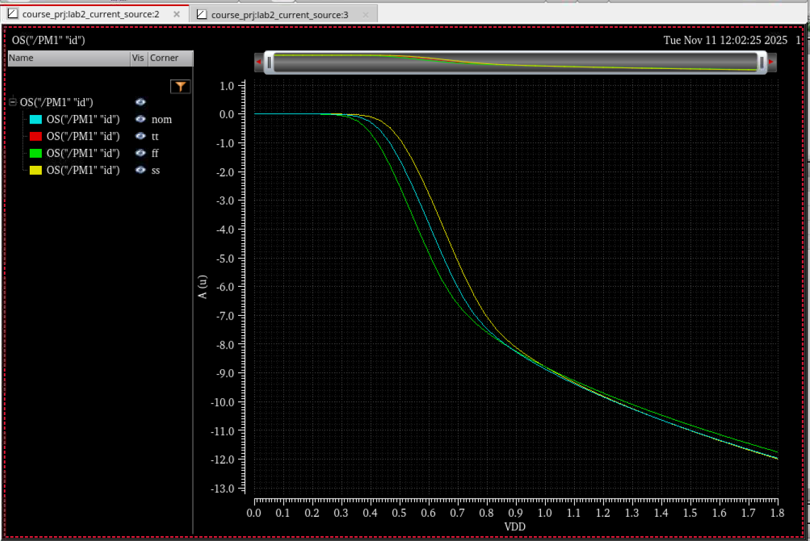
电流-温度曲线如图：
可以发现，三种工艺角下，$I_{\text{out}}$均随着温度上升而呈线性上升。
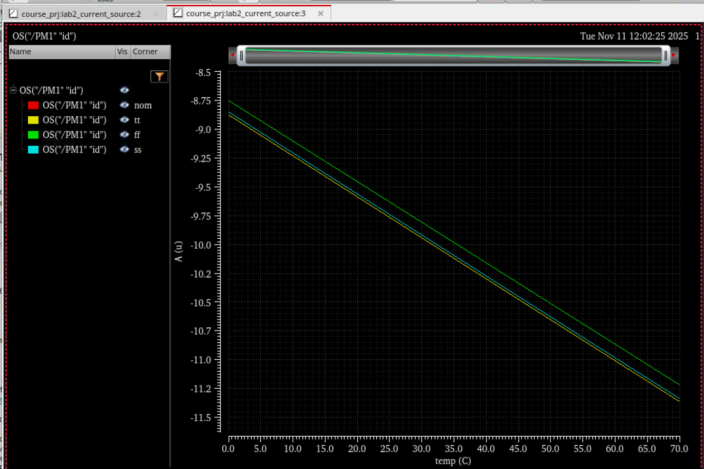

# 任务二. 差分对
## 任务2.1 采用1 中的电流源，利用基本电流镜复制，替换ISS
顶层电路测试图
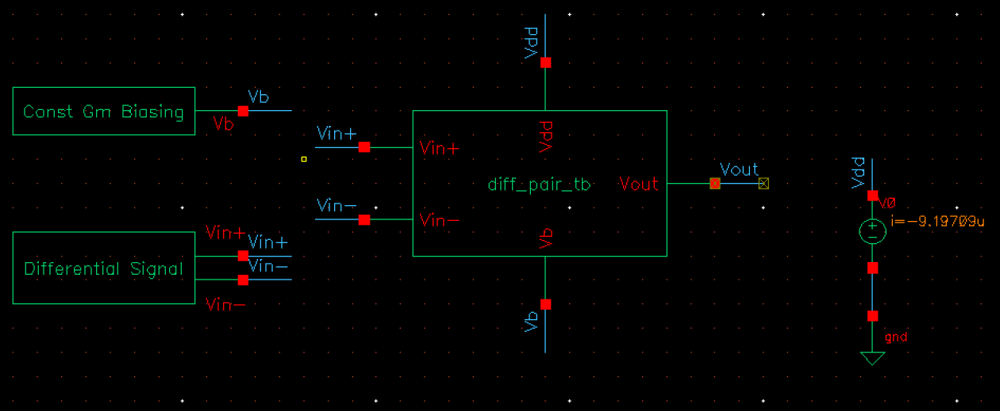
电流镜原理图（即任务一中的电流镜）：
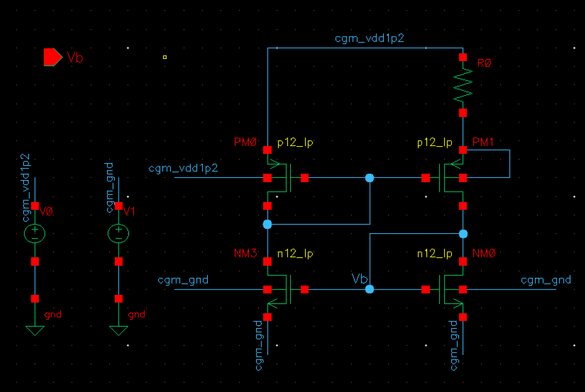
差分对原理图：
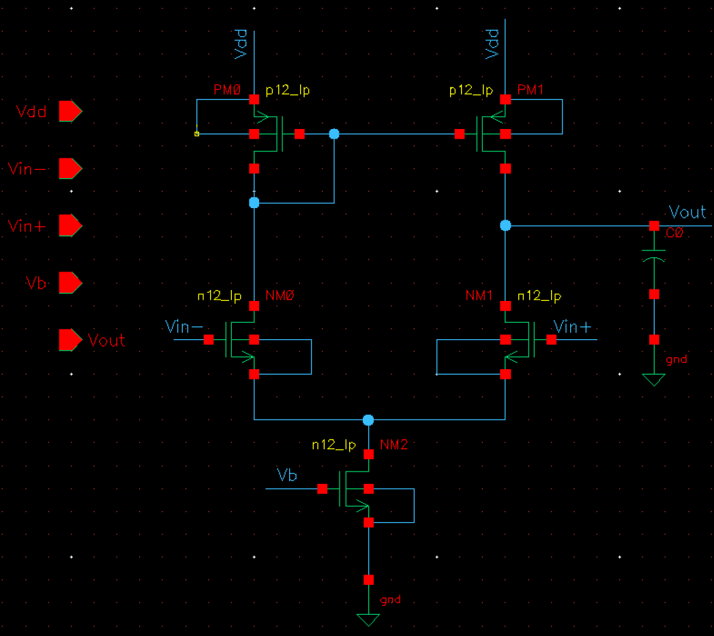
差分信号生成电路图：
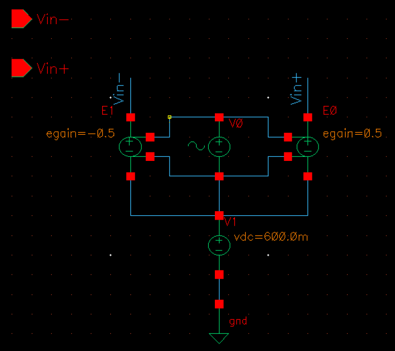

## 任务2.2 M1/M2设置为100um/100nm，M3/M4设置为8um/1um，CL为1pF。进行直流仿真，分析所有晶体管的工作区间
电流镜直流工作点仿真图像：
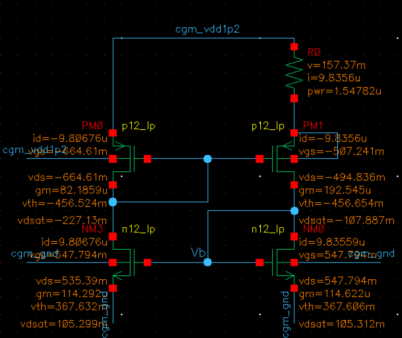
电流镜中所有晶体管的直流工作点：
| MOSFET | $V_{GS}$/mV | $V_{DS}$/mV | $I_{DS}$/$\mu$A | $V_{\text{TH}}$/mV |  $V_{\text{DSAT}}$/mV | 
| --- | --- | --- | --- | --- | --- |
| M1 | 547.794 | 535.39 | 9.807 | 367.632 | 105.299 |
| M2 | 547.794 | 547.794 | 9.836 | 367.606 | 105.312 | 
| M3 | -507.241 | -494.836 | -9.836 | -456.654 | -107.887 | 
| M4 | -664.61 | -664.61 | -9.807 | -456.524 | -227.13 |

差分对直流工作点如图仿真图象：
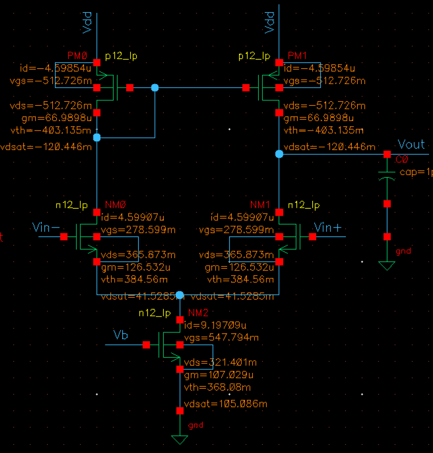
差分对中所有晶体管的直流工作点：
| MOSFET | $V_{GS}$/mV | $V_{DS}$/mV | $I_{DS}$/$\mu$A | $V_{\text{TH}}$ | $V_{\text{DSAT}}$ | 
| --- | --- | --- | --- | --- | --- |
| M1 | 278.599 | 365.873 | 4.599 | 384.56 | 41.5285 |
| M2 | 278.599 | 365.873 | 4.599 | 384.56 | 41.5285 |
| M3 | -512.726 | -512.726 | -4.599 | -403.135 | -120.446
| M4 | -512.726 | -512.726 | -4.599 | -403.135 | -120.446 | 
| $M_{\text{SS}}$ | 547.794 | 321.401 | 9.197 | 368.08 | 105.086 |

## 任务2.3：扫描M3/M4的宽度，将Vout的静态工作点设置为0.6V，记录晶体管设计参数和结果。
设置$W$从1$\mu m$扫描至$16 \mu m$，进行DC仿真，得到$V_{\text{out}}$直流工作点电压与$W$的关系图为：
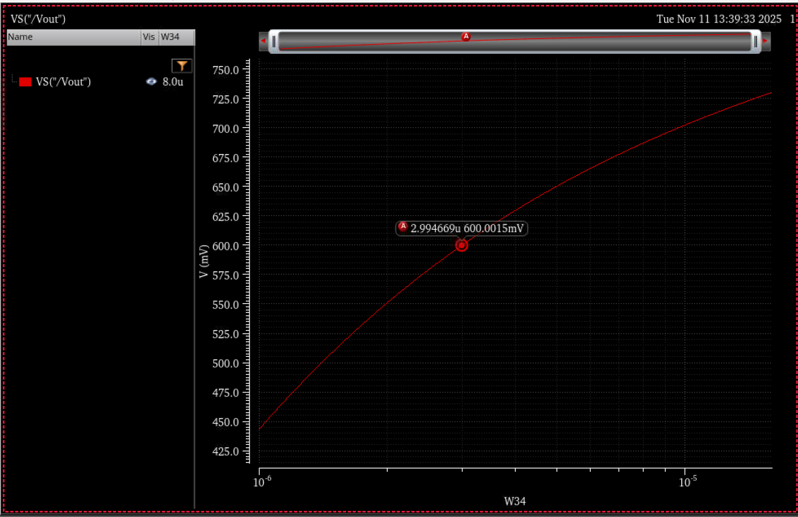
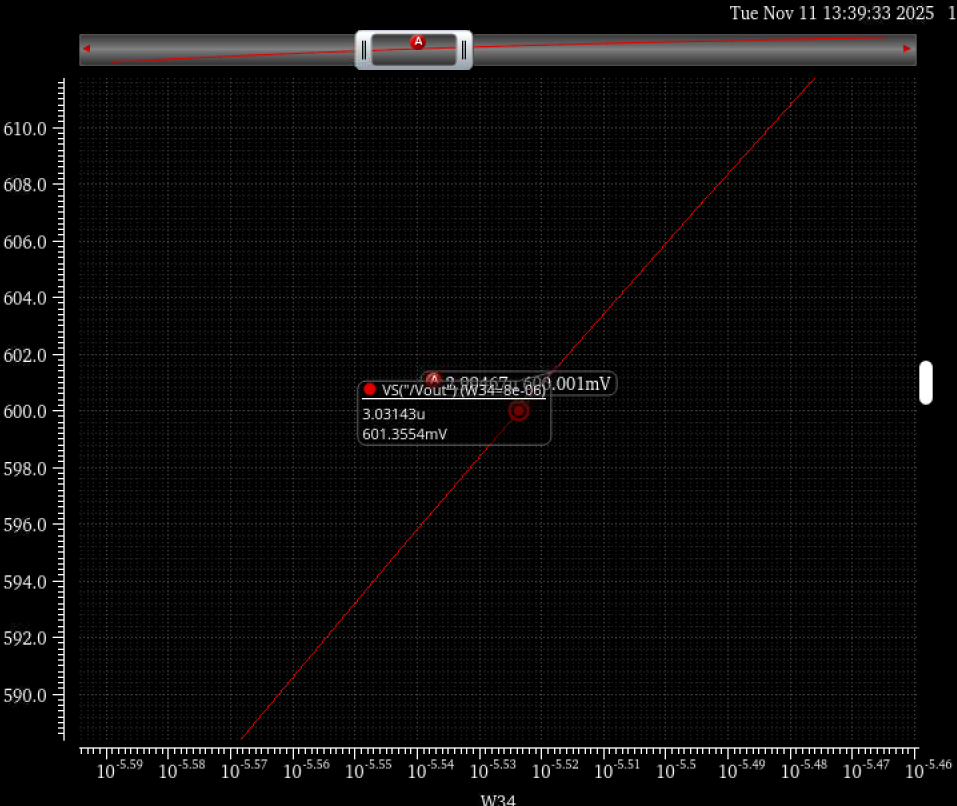
可知，当$V_{\text{out}} \approx 600\text{mV}$时，$W\approx 3\mu m$

## 任务2.4：进行小信号AC仿真，结合实验1中的gmro参数和增益公式，对比仿真结果和解析结果，分析低频增益、带宽、增益带宽积
使用任务2.3中得到的晶体管M3和M4的参数$W=3\mu m$，进行AC仿真，设置频率从1Hz扫描到1GHz，得到$v_{\text{out}}$的增益与频率的曲线图：
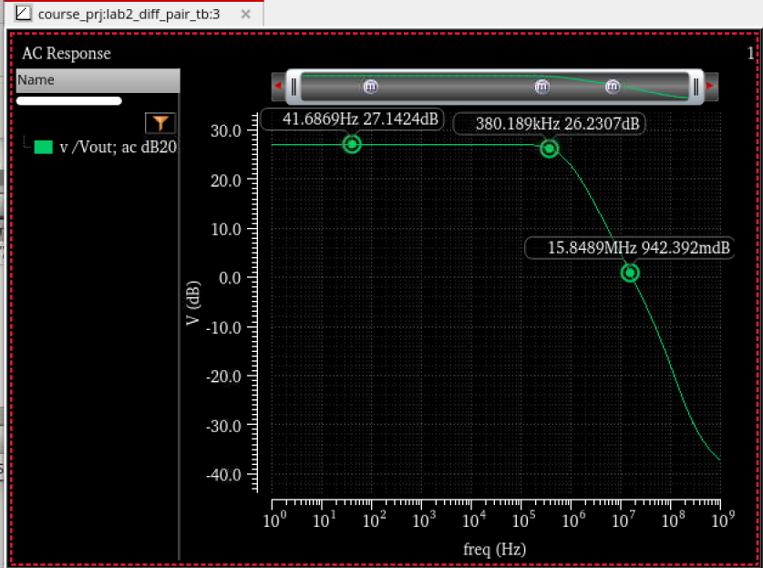
发现，低频增益为27.1424dB，当$f = 380.2\text{kHz}$时，增益开始出现明显下降，因此该差分放大器的带宽为$380\text{kHz}$，增益带宽积为：
当频率来到$f = 15.84\text{MHz}$时，增益下降至0dB。
分析：（待补充）