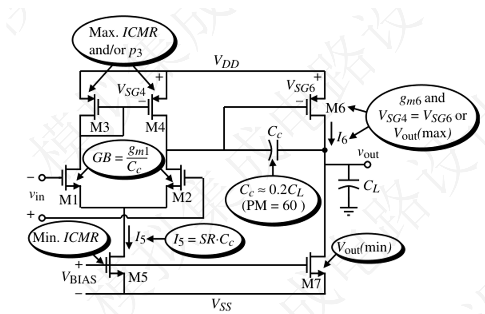

# CMOS Analog integrated circuit design -Lab 3- Final Project-Two Stage Opamp

## I. Design Assignment
You will need to design a two stage differential-to-single-ended opamp, either a folded-cascode topology or a two-stage architecture with the following specifications. This design must be implemented in HLMC 55nm process in Server MOSFET
> 你需要设计一个两级差分转单端运算放大器，可选择折叠共源共栅（folded-cascode）结构或经典两级架构，并满足以下规格要求。该设计必须采用华力微电子（HLMC）55纳米工艺的服务器级MOSFET实现。

---

## II. Specification

### 2.1 Basic
The following specification has to be met, over the temperature from **-40°C to +105°C**, the process **ff/tt/ss** corner and the supply voltage from **1.1V to 1.3V**.
> 以下指标必须在 **-40°C 到 +105°C** 的温度范围内、**ff / tt / ss** 工艺角，以及 **1.1 V 到 1.3 V** 的电源电压范围内全部满足。

| Spec         | Value | Unit |
| ------------ | ----- | ---- |
| VDD          | 1.2   | V    |
| A0           | ≥ 60  | dB   |
| fu           | ≥ 40  | MHz  |
| SR           | ≥ 10  | V/μs |
| CL           | 10    | pF   |
| Output Swing | ≥ 0.6 | V    |
| PM           | ≥ 60  | °    |

### 2.2 Extra design bonus will be given

1. **Total Current (IDD):** as small as possible
2. **FOM (Figure of Merit, 品质因数):**\
  \(\text{FOM} = \frac{\text{GBW} \times C_L}{I_{DD}} \quad (\text{MHz} \times \text{pF} / \text{mA})\)

The higher the FOM, the higher score you may get.

Specs must be met over the temperature from **-40°C to +105°C**, the process **ff/tt/ss** corner and the supply voltage from **1.1V to 1.3V**.
> 所有指标必须在 **-40°C 到 +105°C**、**ff / tt / ss 工艺角**以及 **1.1 V 到 1.3 V 电源电压**范围内满足。
---

## III. Auxiliary Circuits

To bias the circuitry, the current source designed in **Lab 2** can be used as the reference current $I_{REF}$. All other biasing currents must be developed based on $I_{REF}$ using current mirrors.
> 电路偏置可使用**实验二**中设计的电流源作为参考电流 $I_{REF}$。所有其他偏置电流必须基于 $I_{REF}$，通过**电流镜**生成。


## IV. Auxiliary Circuits

### 4.1 Design File
All design files and cellviews have to be in a single library and folder, then to be tar+zipped with the following command and file format:

```bash
tar -czf YourAccountName.tar.gz PathOfYourDesignLibrary
```

For instance:

```bash
tar -czf hansy22.tar.gz ~/CMOSICDESIGN2023
```

### 4.2 Design Report

A maximum **4 pages** report has to be submitted via **CANVAS** system, with the following key sections:

1. Title, Abstract, Index, Author
2. Introduction: why this work is worth designing
3. Architecture: how to determine the topology
4. Design approach
5. Design calculations
6. Complete circuit schematic with device dimensions, passive component values and test bench with simulation conditions
   > 完整电路原理图（包含器件尺寸、无源元件参数）及测试平台与仿真条件
7. Simulation results (better if including estimated parasitics): tables and plots
   > 仿真结果（建议包含寄生参数估计）：表格与波形图
8. Discussions / conclusions: what you have done, what yet have to be done
   > 讨论与总结：已完成的工作及尚需改进之处
9.  References


---


## V. Basic Design Guideline

**Stability and Slew-rate oriented design procedure** for a two-stage Miller-compensated opamp.\
Reference: *CMOS Analog Circuit Design*, 3rd Edition, by **P. Allen**.
> 针对**两级 Miller 补偿运算放大器**的**稳定性与转换速率导向设计流程**。\
> 参考书目：P. Allen，《CMOS Analog Circuit Design》第 3 版。

Design targets:
- VDD = 1.2 V
- A0 ≥ 60 dB
- $f_u$ / $GBW$ ≥ 40 MHz
- $SR$ ≥ 10 $V/\mu s$
- $C_L$ = 10 pF
- Output Swing ≥ 0.6 V
- PM ≥ 60°



### 1. Device Dimension Choice

Choose the smallest device length that will keep the channel modulation parameter constant and give good matching for current mirrors. For devices requiring critical matching, please start with **W or L at least 3 times** the minimum W or L (e.g., input differential pair, current mirrors).
> 选择**尽可能小的沟道长度**，在保证沟道长度调制参数基本不变的同时，确保电流镜具有良好的匹配性。对于需要**关键匹配**的器件（如输入差分对、电流镜），建议 **W 或 L 至少为最小尺寸的 3 倍**。

In practical designs, the input device should be kept into minimum, as long as **PVT** and **Monte Carlo** simulations verify acceptable performance spread.
> 在实际设计中，只要 **PVT** 和 **蒙特卡洛仿真**验证性能分布可接受，输入晶体管尺寸应尽量取小。


### 2. Differential Pair and Output Common-Source Amplifier

1. From the desired phase margin, choose the minimum value for **Cc**. For a **60°** phase margin:

   \(C_c > 0.22 C_L\)

2. Determine the minimum value for the "tail current **I5**" from the larger of the two values.

3. Determine **gm1** from **GBW**.

4. From steps 3 and 4, estimate the **W/L** for the input pairs. (In deep-submicron processes, simulation curves are preferred over simple square-law models.)

5. Check if **gm/Id** is acceptable (large enough, typically **> 15**, for small overdrive voltage and low noise). If not, increase **gm**.

6. Guarantee stability by ensuring that the second pole **p2** is beyond **2.2 × GB**:

   \(g_{m6} = 2.2 g_{m2} \left( \frac{C_L}{C_c} \right)\)

7. Determine the minimum value for the "tail current **I6**" from the largest of the two values, for slew rate requirements.

8. From steps 6 and 7, calculate the **W/L** for transistor 6. (In deep submicron process, you may need to look up the simulation curve, rather than the simple square law)

9. Check if **gm/Id** is acceptable (typically **> 15**).

10. Check if the gain meets specifications; if not, increase **gm**.

> 1. 根据期望的相位裕度选择补偿电容 **Cc** 的最小值。对于 **60° 相位裕度**：
   \(C_c > 0.22 C_L\)
> 2. 根据两种约束条件中较大的一个，确定尾电流 **I5** 的最小值。
> 3. 由 **GBW** 确定输入级的跨导 **gm1**。
> 4. 结合步骤 3 和 4，估算输入差分对的 **W/L**。（在深亚微米工艺下，应优先参考仿真曲线，而非简单平方律模型。）
> 5. 检查 **gm/Id** 是否足够大（通常要求 **> 15**，以获得较小的过驱动电压和较低噪声）。若不足，则增大 **gm**。
> 6. 保证系统稳定性，使第二极点 **p2** 至少位于 **2.2 × GB** 之外：
   \(g_{m6} = 2.2 g_{m2} \left( \frac{C_L}{C_c} \right)\)
> 7. 根据两个值中的较大者确定"尾电流 **I6**"的最小值，以满足压摆率要求。
> 8. 根据步骤 6 和 7 计算第 6 管的 **W/L**。（深亚微米工艺下建议查仿真曲线。）
> 9. 再次检查 **gm/Id** 是否满足要求（通常 **> 15**）。
> 10. 检查增益是否满足指标；若不足，则增大 **gm**。

---

### 3. Current Mirror Design

11. Calculate the required **Vgs6**, and check whether **Vgs3 = Vgs6**.
12. Push the mirror pole and zero caused by **Cgs3** and **Cgs4** to be larger than **10 × GBW**. Note that a zero exists at **2p3**, which will reduce the influence of **p3** on the opamp.
13. Ensure that the **W/L** of **M3/M4** and **M5/M7** are sufficiently large to minimize overdrive voltage, so that both input and output have large voltage swing.

> 11. 计算所需的 **Vgs6**，并检查 **Vgs3 是否等于 Vgs6**。
> 12. 将由 **Cgs3** 和 **Cgs4** 引入的电流镜极点与零点推至 **10 × GBW** 以上。注意在 **2p3** 处存在一个零点，可削弱极点 **p3** 对运放性能的影响。
> 13. 确保 **M3/M4** 与 **M5/M7** 的 **W/L** 足够大，以减小过驱动电压，从而保证输入与输出具有较大的电压摆幅。