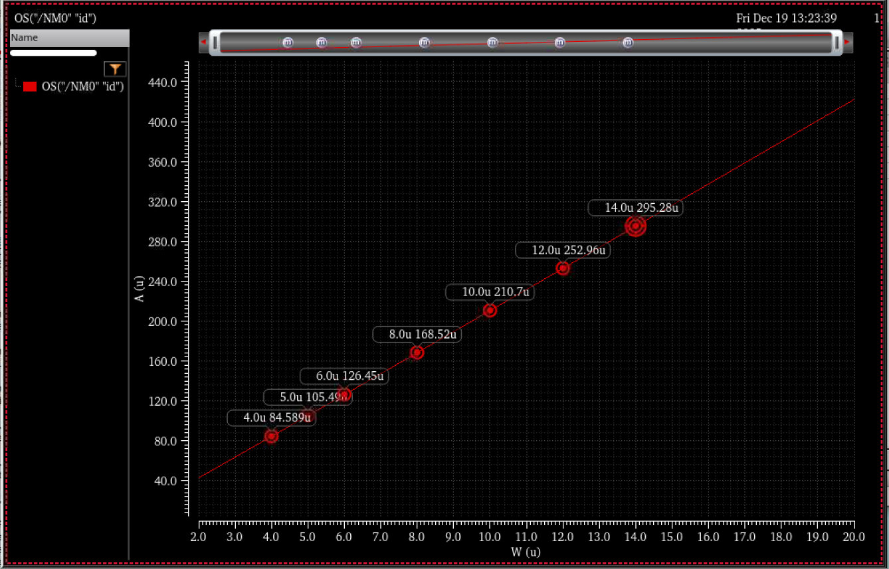
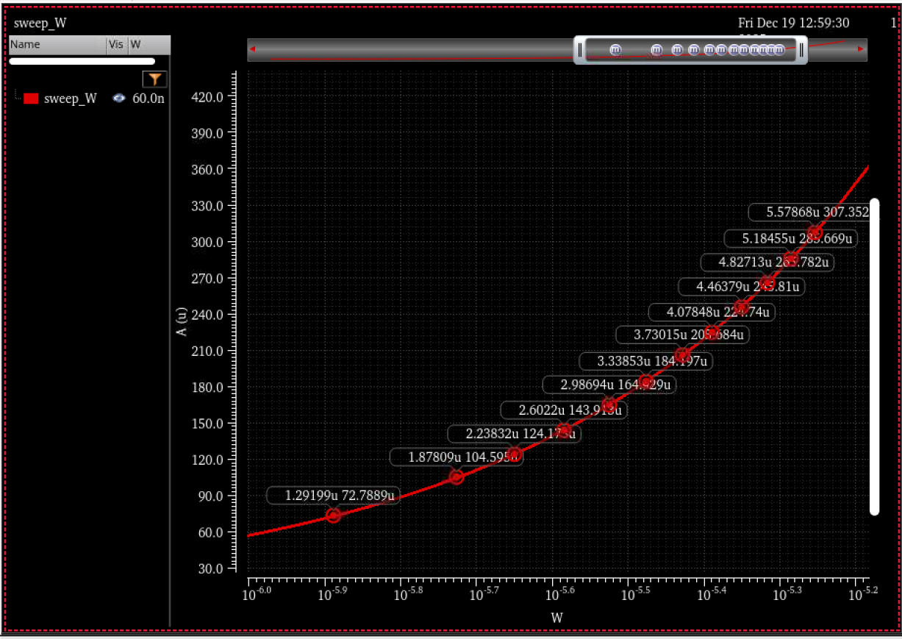

## GCB_tb
如图所示电流源（就是Lab2的电流源）：

当$VDD=1.2V$，M5的$L=60\text{nm}, W \approx 240\text{nm}$时，$I \approx 22.72\mu A$ 

暂时选取M5管的$W = 250\text{nm}$

## NMOS_IV_test
对M1进行测试，找到具有符合条件的跨导的宽度$W$
要求$g_{m1} \geq 88 \mu S$
我们取$g_{m1} = 108\mu S$
当$Vgs = 0.6V, VDD = 1.2V$，不存在体效应时：
- $W = 80nm, g_m = 70.86\mu S$
- $W = 90nm, g_m = 72.995\mu S$
- $W = 100nm, g_m = 76.1507\mu S$
- $W = 110nm, g_m = 79.8898\mu S$
- $W = 120nm, g_m = 84.0927\mu S$
- $W = 130nm, g_m = 88.6575\mu S$
- $W = 140nm, g_m = 93.5045\mu S$
- $W = 150nm, g_m = 98.5896\mu S$
- $W = 160nm, g_m = 103.831\mu S$
- 似乎宽度每增加5nm，$g_m$就增加$5\mu S$
- $W = 170nm, g_m = 109.209\mu S$
- $W = 180nm, g_m = 114.693\mu S$
- $W = 190nm, g_m = 120.263\mu S$
- $W = 200nm, g_m = 125.899\mu S$
- 我们暂时选择$W=170nm, g_m = 109.209\mu S$