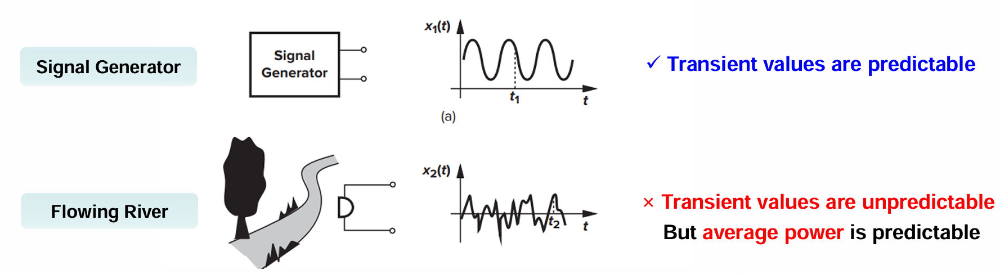
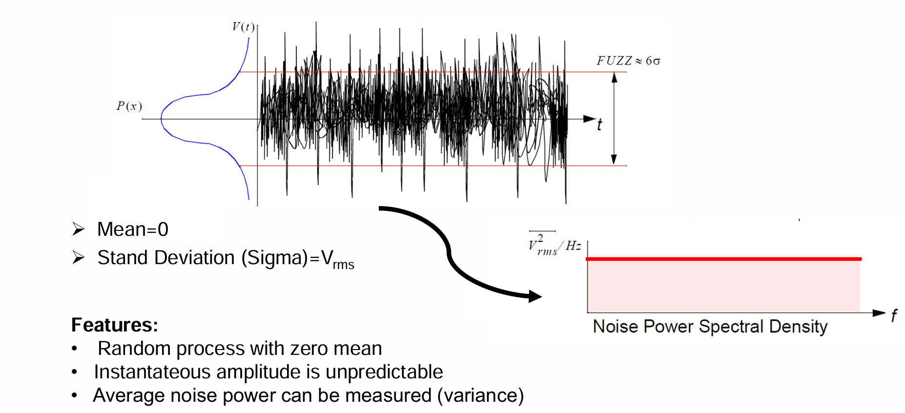
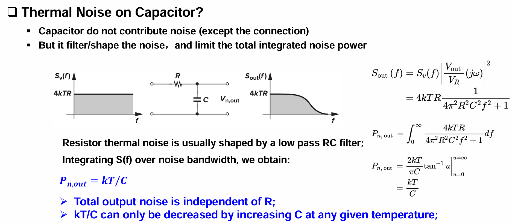
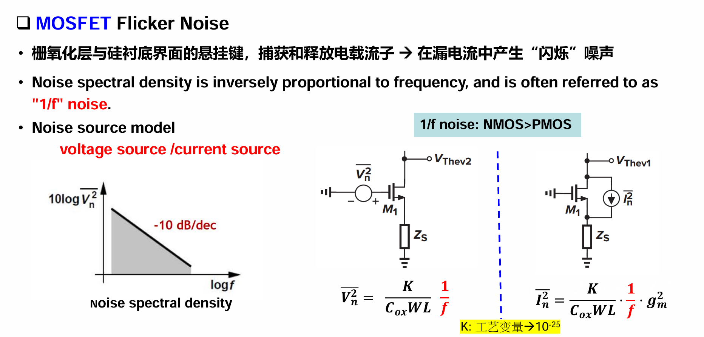
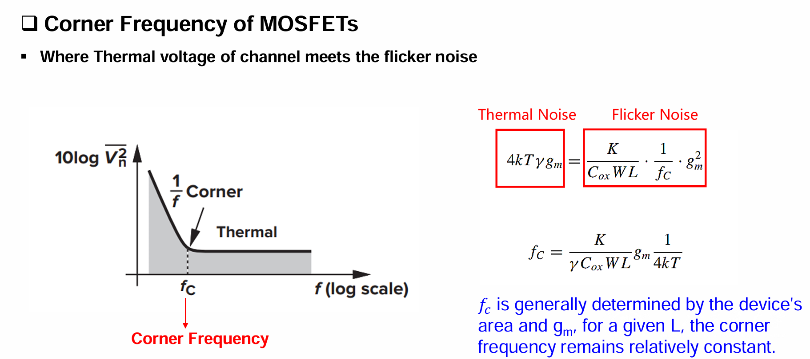
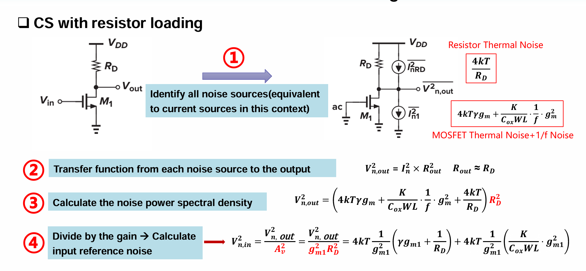
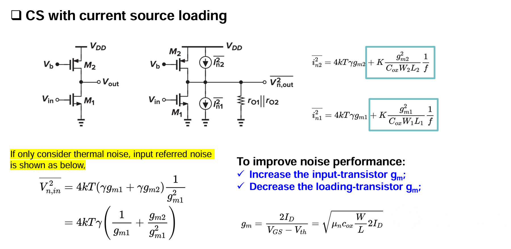
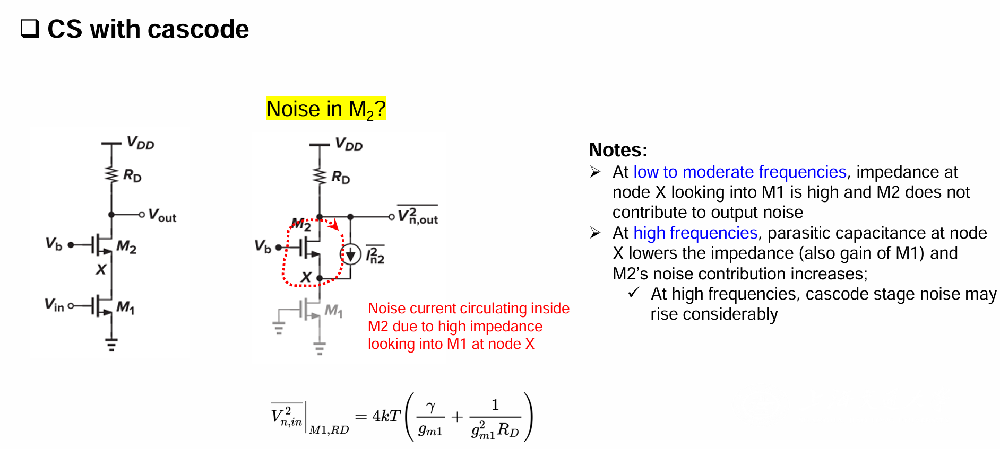
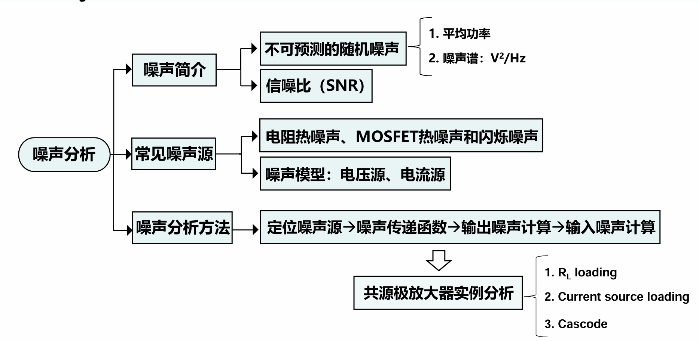

# 目录

- [一. 噪声基础概念](#一-噪声基础概念)
  - [1.1 什么是噪声？](#11-什么是噪声)
  - [1.2 噪声的核心参数](#12-噪声的核心参数)
    - [1.2.1 平均功率与均方根电压（RMS）](#121-平均功率与均方根电压rms)
    - [1.2.2 功率谱密度（PSD，又称噪声谱）](#122-功率谱密度psd又称噪声谱)
    - [1.2.3 相关与不相关噪声](#123-相关与不相关噪声)
    - [1.2.4 信噪比（SNR）](#124-信噪比snr)
- [二. 噪声的主要类型](#二-噪声的主要类型)
  - [2.1 环境噪声](#21-环境噪声)
  - [2.2 器件电子噪声（核心）](#22-器件电子噪声核心)
    - [2.2.1 热噪声（又称高斯噪声、白噪声）](#221-热噪声又称高斯噪声白噪声)
    - [2.2.2 闪烁噪声（1/f噪声）](#222-闪烁噪声1f噪声)
    - [2.2.3 转角频率（$f_C$）](#223-转角频率fc)
- [三. 集成电路元件噪声模型总结](#三-集成电路元件噪声模型总结)
- [四. 单级放大器噪声计算（四步法）](#四-单级放大器噪声计算四步法)
  - [4.1 四步分析法](#41-四步分析法)
  - [4.2 共源极放大器（CS）噪声计算实例](#42-共源极放大器cs噪声计算实例)
    - [4.2.1 电阻负载共源极放大器](#421-电阻负载共源极放大器)
    - [4.2.2 电流源负载共源极放大器](#422-电流源负载共源极放大器)
    - [4.2.3 共源共栅（Cascode）放大器](#423-共源共栅cascode放大器)
- [五. 核心总结与学习要点](#五-核心总结与学习要点)
  - [5.1 核心概念速记](#51-核心概念速记)
  - [5.2 设计优化思路](#52-设计优化思路)
  - [5.3 Summary](#53-summary)
# 目录

- [目录](#目录)
- [噪声](#噪声)
  - [一. 噪声基础概念](#一-噪声基础概念)
    - [1.1 什么是噪声？](#11-什么是噪声)
    - [1.2 噪声的核心参数](#12-噪声的核心参数)
      - [1.2.1 平均功率与均方根电压（RMS）](#121-平均功率与均方根电压rms)
      - [1.2.2 功率谱密度（PSD，又称噪声谱）](#122-功率谱密度psd又称噪声谱)
      - [1.2.3 相关与不相关噪声](#123-相关与不相关噪声)
      - [1.2.4 信噪比（SNR）](#124-信噪比snr)
  - [二. 噪声的主要类型](#二-噪声的主要类型)
    - [2.1 环境噪声](#21-环境噪声)
    - [2.2 器件电子噪声（核心）](#22-器件电子噪声核心)
      - [2.2.1 热噪声（又称高斯噪声、白噪声）](#221-热噪声又称高斯噪声白噪声)
      - [2.2.2 闪烁噪声（1/f噪声）](#222-闪烁噪声1f噪声)
      - [2.2.3 转角频率（$f\_C$）](#223-转角频率f_c)
  - [三. 集成电路元件噪声模型总结](#三-集成电路元件噪声模型总结)
  - [四. 单级放大器噪声计算（四步法）](#四-单级放大器噪声计算四步法)
    - [4.1 四步分析法](#41-四步分析法)
    - [4.2 共源极放大器（CS）噪声计算实例](#42-共源极放大器cs噪声计算实例)
      - [4.2.1 电阻负载共源极放大器](#421-电阻负载共源极放大器)
      - [4.2.2 电流源负载共源极放大器](#422-电流源负载共源极放大器)
      - [4.2.3 共源共栅（Cascode）放大器](#423-共源共栅cascode放大器)
  - [五. 核心总结与学习要点](#五-核心总结与学习要点)
    - [5.1 核心概念速记](#51-核心概念速记)
    - [5.2 设计优化思路](#52-设计优化思路)
    - [5.3 Summary](#53-summary)
# 噪声
## 一. 噪声基础概念
### 1.1 什么是噪声？
- 核心定义：电路中**除目标信号外的随机信号**（**与“干扰”不同**：干扰是可预测的确定信号，噪声是不可预测的随机信号）。
- 直观理解：比如造成屏幕白斑的信号、影响微弱信号检测的杂波，都属于噪声。
  
- 关键特点：瞬时值无法预测，但**平均功率或均方根电压可测量**（这是噪声分析的核心依据）。

### 1.2 噪声的核心参数
#### 1.2.1 平均功率与均方根电压（RMS）
- 平均功率（$P_{av}$）：描述噪声的总能量，公式为：
  $$P_{av}=\lim _{T \to \infty} \frac{1}{T} \int_{-T / 2}^{+T / 2} x^{2}(t) dt$$
  （$x(t)$ 为**噪声信号**，$T$ 为观测时间）
- 均方根电压（$V_{rms}$）：噪声电压的有效数值，与平均功率的关系：
  $$V_{rms}=\sqrt{P_{av}}$$

#### 1.2.2 功率谱密度（PSD，又称噪声谱）
**(1) 定义**：
描述噪声在**不同频率上的功率分布**，单位是 $V^2/Hz$ 或 $A^2/Hz$。

**(2) 物理意义**：
用**理想带通滤波器**提取某一频率 $f_1$ 附近1Hz带宽的噪声，得到的功率就是该频率下的PSD值。

**(3) 数学分析**：
这里停一停，我们先理一理为什么要引入$S_{X}(f)$来衡量噪声，一级$S_{X}(f)$的数学本质。

噪声是随机信号，如果我们还像原来一样用时域表达式$x(t)$，有什么问题呢？**问题就是$x(t)$在任何时刻都是随机的，“你今天量到的值，明天不一样”，“这个噪声电压是多少伏？”这个问题本身没有意义。**

**那么什么量是稳定的呢？——$E[x^2(t)]$**，噪声的均方根是稳定的，我们用它来衡量噪声的强弱。这一步是物理上强制的，不是人为选择。
> 从物理上理解：$x(t)$是一条疯狂抖动的波形，$xx^2(t)$永远是正的。而其均方根
> $$E[x^2(t)] = \frac{1}{T} \int_{-T/2}^{+T/2} x^2(t) dt$$
> 是一个稳定的量，即：如果噪声是平稳的，那么：
**“今天3点测”和“明天3点测”，均方值是一样的**
    
但是均方根只能告诉我们噪声的总强度，**不能告诉我们噪声在频率上的分布情况**。而频率分布情况对于电路设计非常重要，因为不同频率的噪声对电路的影响不同。于是我们引入了功率谱密度$S_X(f)$，它告诉我们每个频率上有多少噪声功率。

首先，我们定义出自相关函数$R_X(\tau)$：
$$R_X(\tau) = E[x(t)x(t+\tau)] = \lim_{T \to \infty} \frac{1}{T} \int_{-T/2}^{+T/2} x(t)x(t+\tau) dt$$

那么自相关函数的一个特例就是：
$$R_X(0) = E[x^2(t)] = P_{av}$$

我们引入自相关函数的频域形式（**即$R_X(\tau)$的连续时间傅里叶变换**），来研究噪声在频域上的特性，即**功率谱密度**：
$$S_X(f) = \int_{-\infty}^{+\infty} R_X(\tau) e^{-j2\pi f \tau} d\tau$$

其连续时间傅里叶反变换：
$$R_X(\tau) = \int_{-\infty}^{+\infty} S_X(f) e^{j2\pi f \tau} df$$

于是就有：
$$P_{av} = E[x^2(t)] = R_X(0) = \int_{-\infty}^{+\infty} S_X(f) df$$   

至此，我们严格给出了**噪声的功率谱密度**$S_X(f)$的数学定义。从表达式 \[E[x^2(t)]=\int_{-\infty}^{+\infty}S_X(f)df\]，我们也可以直接理解出：
$S_{X}(f)$ 表示**在频率** $f$ **处的噪声功率密度**。

**(4) 重要关系：系统中噪声的传递遵循**
  $$S_Y(f)=S_X(f)|H(f)|^2$$
  其中 $H(f)$ 是系统传递函数，即系统会像“滤波器”一样改变输入噪声的谱形。

#### 1.2.3 相关与不相关噪声
(1) 不相关噪声（多数情况）：独立器件产生的噪声，**总平均功率 = 各噪声平均功率之和（直接叠加）**。
数学表达式：
$$P_{av,total} = P_{av,1} + P_{av,2} + ... + P_{av,n}$$
(2) 相关噪声：噪声之间存在关联，总平均功率 = **各噪声平均功率之和 + 相关部分（噪声会更大）**。
数学表达式：
$$P_{av,total} = P_{av,1} + P_{av,2} + ... + P_{av,n} + 2\sum_{i \neq j} E[x_i(t)x_j(t)]$$
(3) 工程应用中，**大多数噪声源是不相关的**，因此可以直接将各噪声功率相加。

这一段PPT写的极烂，什么“相关部分”明显掩盖了数学本质，我们从头理一理：
首先假设我们有一系列**零均值**，宽平稳的随机过程$x_1(t),x_2(t),...,x_n(t)$，它们的总和是：
$$x_{\text{total}}(t) = x_1(t) + x_2(t) + ... + x_n(t)$$
我们先不做任何假设，直接写出总和的均方根（其实就是方差）：
$$E[x_{\text{total}}^2(t)] = E\left[\left(\sum_{i=1}^n x_i(t)\right)^2\right] = \sum_{i=1}^n E[x_i^2(t)] + 2\sum_{i<j} E[x_i(t)x_j(t)]$$
关于$2\sum_{i<j} E[x_i(t)x_j(t)]$，这里就有两种情况：
**(1) 如果这些噪声源两两不相关，** 即协方差$\text{Cov}(x_i(t), x_j(t)) = 0$，则：
$$E[x_i(t)x_j(t)] = 0 \quad \text{for} \quad i \neq j$$
因此，总均方根为各噪声均方根之和：
$$E[x_{\text{total}}^2(t)] = \sum_{i=1}^n E[x_i^2(t)]$$
**(2) 如果噪声源相关，** 则$E[x_i(t)x_j(t)] \neq 0$，总均方根包含相关项。那么就有噪声总和的均方根：
$$E[x_{\text{total}}^2(t)] = \sum_{i=1}^n E[x_i^2(t)] + 2\sum_{i<j} E[x_i(t)x_j(t)]$$

#### 1.2.4 信噪比（SNR）
(1) **定义**：
衡量信号与噪声的比例，是电路性能的关键指标，公式分两种形式：
1. 功率比：$$SNR=\frac{P_{signal}}{P_{noise}}=\frac{V_{rms,signal}^2}{V_{rms,noise}^2}$$
2. 分贝（dB）表示（工程常用）：$$SNR=10\log\left(\frac{P_{signal}}{P_{noise}}\right)=20\log\left(\frac{V_{rms,signal}}{V_{rms,noise}}\right)$$

关键结论：
- 当信号与噪声的均方根电压相等时，$SNR=0$（无法区分信号和噪声）。
- 放大器**不能提高输入信号的SNR**：**因为放大器会同时放大信号和噪声，还会引入自身噪声，反而可能降低SNR。**

补充：dBm单位（功率绝对值参考）：以1mW为参考，1mW=0dBm，1μW=-30dBm（**用于量化噪声功率的绝对大小**）。

## 二. 噪声的主要类型
噪声分为“环境噪声”和“器件电子噪声”，核心重点是器件电子噪声（电路设计中主要优化对象）。

### 2.1 环境噪声
- 来源：通过衬底耦合、电源/地线耦合引入的噪声（外部干扰）。
- 解决方案：采用**全差分电路**、优化版图设计（如增加地线宽度、隔离敏感区域）。

### 2.2 器件电子噪声（核心）
由电子的随机运动或制造工艺缺陷导致，分为热噪声和闪烁噪声（1/f噪声）。

#### 2.2.1 热噪声（又称高斯噪声、白噪声）
**(1) 起源**：
导体中电子的**随机热运动**（温度越高，运动越剧烈，噪声越大）。

**(2)核心特点**：
1. **零均值**（噪声电压正负对称，平均为0）；
2. **高斯分布**（瞬时值的概率符合高斯曲线）；
3. **与温度成正比**（$T$ 越高，噪声越大）；
4. **与频率无关**（白噪声：所有频率下PSD恒定）；
5. **与电流无关**（只要有温度，就有热噪声）。
> 这里补充一下高斯噪声的数学特性：
> 均值：$E[x(t)]=0$
> 方差：$E[x^2(t)]=\sigma^2$，即：$\sigma = \sqrt{E[x^2(t)]} = \sqrt{P_{\text{av}}} = V_{\text{rms}}$
> 
> 注意$3-\sigma$原则，即约99.7%的噪声值落在均值的正负3倍标准差范围内。

**(3) 具体器件的热噪声模型**：
**① 电阻热噪声**：
- 电压谱密度：$$\boxed{S_v(f)=4kTR}$$（$k$=玻尔兹曼常数，$T$=绝对温度，$R$=电阻值）
- 电流谱密度：$$\boxed{\overline{I_n^2}=\frac{4kT}{R}}$$
- 等效模型：无噪声电阻串联一个电压源（$V_n^2=4kTR$），或并联一个电流源（$I_n^2=4kT/R$）。

**② MOSFET热噪声**：
- 起源：MOSFET沟道中电子的随机热运动。
- 电流谱密度：$$\boxed{\overline{I_n^2}=4kT\gamma g_m}$$（$g_m$=MOSFET跨导，长沟道MOSFET中$\gamma=2/3$，经验值）
- 电压谱密度：$$\boxed{\overline{V_n^2}=\frac{\overline{I_n^2}}{g_m^2}=\frac{4kT\gamma}{g_m}}$$
- 等效模型：源极和漏极之间并联一个电流源（$I_n^2=4kT\gamma g_m$），或栅极串联一个电压源（$V_n^2=I_n^2/g_m^2$）。

**③ kT/C噪声（热噪声的滤波效应）**：
- 关键结论：电容本身不产生噪声，但会对电阻热噪声进行低通滤波，限制总噪声功率。
- **总输出噪声功率**：$$\boxed{P_{n,out}=\frac{kT}{C}}$$（与电阻$R$无关，仅与电容$C$和温度$T$有关）
  > **证明：**
  > 
  > 传递函数：$$\frac{v_{\text{out}}}{v_{\text{in}}}(j\omega)$$
  > 输出噪声PSD：$$S_{n,out}(f)=S_{n,in}(f)\cdot\left|\frac{v_{\text{out}}}{v_{\text{in}}}(j2\pi f)\right|^2$$
  > 总输出噪声功率：$$P_{n,out}=\int_{0}^{\infty} S_{n,out}(f) df = \int_{0}^{\infty} 4kTR \cdot \frac{1}{1+(2\pi f RC)^2} df$$
  > 令$x=2\pi f RC$，则$df=\frac{dx}{2\pi RC}$，代入上式：
  > $$P_{n,out}=\int_{0}^{\infty} 4kTR \cdot \frac{1}{1+x^2} \cdot \frac{dx}{2\pi RC} = \frac{4kT}{2\pi C} \int_{0}^{\infty} \frac{1}{1+x^2} dx$$
  > 由于$\int_{0}^{\infty} \frac{1}{1+x^2} dx = \frac{\pi}{2}$，所以：
  > $$P_{n,out}=\frac{4kT}{2\pi C} \cdot \frac{\pi}{2} = \frac{kT}{C}$$
- 优化方法：**增大电容$C$可降低kT/C噪声（温度固定时）。**

#### 2.2.2 闪烁噪声（1/f噪声）
- 起源：制造工艺中的**杂质、晶体缺陷**（如MOSFET栅氧化层与硅衬底界面的“悬挂键”），这些缺陷会“捕获”和“释放”电荷，导致电流波动。
- 核心特点：
  1. **与频率成反比（低频时噪声显著，频率越高，噪声越小，因此又称“低频噪声”）**；
  2. 与直流电流相关（必须**有电流流过，才会产生**）；
  3. 存在于有源器件（MOSFET、晶体管）和部分无源器件（碳电阻）中；
  4. **NMOS的1/f噪声 > PMOS的1/f噪声（设计时可优先用PMOS降低低频噪声）**。

- MOSFET的闪烁噪声模型：
  - 电压谱密度：$$\boxed{\overline{V_n^2}=\frac{K}{C_{ox}WL}\cdot\frac{1}{f}}$$（$K$=工艺变量（$10^{-25} \sim 10^{-23}$），$C_{ox}$=栅氧化层电容密度，$W$=栅宽，$L$=栅长，$f$=频率）
  - 电流谱密度：$$\boxed{\overline{I_n^2}=\frac{K}{C_{ox}WL}\cdot\frac{1}{f}\cdot g_m^2}$$
  - 等效模型：栅极串联一个电压源（上述公式），或源漏之间并联一个电流源。

#### 2.2.3 转角频率（$f_C$）
- 定义：**热噪声与闪烁噪声的PSD相等时的频率（区分低频和高频噪声的分界点）**。

- 公式：$$\boxed{f_C=\frac{K}{\gamma C_{ox}WL}\cdot\frac{g_m}{4kT}}$$
- 特点：$f_C$ 由器件面积（$WL$）和跨导（$g_m$）决定，固定栅长$L$时，$f_C$ 基本恒定。
  - 低频段（$f < f_C$）：闪烁噪声主导；
  - 高频段（$f > f_C$）：热噪声主导。

## 三. 集成电路元件噪声模型总结
| 元件       | 噪声类型       | 等效模型（核心）                | 关键公式                                  |
|------------|----------------|---------------------------------|-------------------------------------------|
| 电阻       | 热噪声         | 串联电压源 / 并联电流源         | $S_v(f)=4kTR$；$\overline{I_n^2}=4kT/R$              |
| MOSFET     | 热噪声         | 源漏并联电流源                  | $\overline{I_n^2}=4kT\gamma g_m$（$\gamma=2/3$）      |
| MOSFET     | 闪烁噪声（1/f）| 栅极串联电压源                  | $\overline{V_n^2}=\frac{K}{C_{ox}WL}\cdot\frac{1}{f}$ |
| 电容       | 无自身噪声     | 低通滤波器（抑制热噪声）        | 总噪声功率$P_{n,out}=kT/C$                |

## 四. 单级放大器噪声计算（四步法）
噪声分析的核心是“输入参考噪声”（将电路所有噪声等效到输入端，方便评估对输入信号的影响），步骤如下：

### 4.1 四步分析法
1. 识别**所有噪声源及对应的谱密度**（如电阻热噪声、MOSFET热噪声+1/f噪声）；
2. 求**每个噪声源**到输出端的**传递函数**（$H_i(f)$，即噪声源在输出端产生的噪声与自身的比值）；
3. 计算各噪声源的**输出噪声PSD**，求和得到总输出噪声PSD（$S_{n,out}=\sum|H_i|^2S_{n,i}$）；
4. 计算**输入参考噪声**（$S_{n,in}=S_{n,out}/|H|^2$，$H$是放大器的总增益），**再计算SNR**。

### 4.2 共源极放大器（CS）噪声计算实例
共源极放大器是最基础的单级放大器，重点分析三种负载情况：

#### 4.2.1 电阻负载共源极放大器

- 电路结构：MOSFET（M1）作为放大管，电阻$R_D$作为负载。
- 步骤1：识别噪声源（2个核心噪声源）：
  ① 负载电阻$R_D$的热噪声：$\overline{I_{n,R_D}^2}=4kT/R_D$；
  ② MOSFET的热噪声+1/f噪声：$\overline{I_{n,M1}^2}=4kT\gamma g_m + \frac{K}{C_{ox}WL}\cdot\frac{1}{f}\cdot g_m^2$。

- 步骤2：传递函数：
  输出电阻$R_{out}\approx R_D$，每个噪声源到输出的传递函数均为$R_D$（电流源流过$R_D$产生输出电压）。

- 步骤3：总输出噪声PSD：
  $$V_{n,out}^2=\left(4kT\gamma g_m + \frac{K}{C_{ox}WL}\cdot\frac{1}{f}\cdot g_m^2 + \frac{4kT}{R_D}\right)R_D^2$$

- 步骤4：输入参考噪声：
  放大器电压增益$A_v=-g_m R_D$（绝对值$|A_v|=g_m R_D$），输入参考噪声：
  $$\boxed{V_{n,in}^2=\frac{V_{n,out}^2}{A_v^2}=4kT\left(\frac{\gamma}{g_m} + \frac{1}{g_m^2 R_D}\right) + \frac{K}{C_{ox}WL f}}$$

#### 4.2.2 电流源负载共源极放大器

- 核心特点：用电流源替代电阻$R_D$，输出电阻更高（增益更大）。
- 输入参考噪声（如果只考虑热噪声）：
  $$\boxed{\overline{V_{n,in}^2}=4kT\gamma(\frac{1}{g_{m1}}+\frac{g_{m2}}{g_{m1}^2})}$$
- 噪声优化方向：
  1. 增大输入管M1的$g_m$（降低热噪声贡献）；
  2. 减小负载管的$g_m$（负载管的噪声贡献与自身$g_m$成正比）。
   > $$g_m = \frac{2I_D}{V_{GS}-V_{TH}} = \sqrt{\mu_n C_{\text{ox}}\frac{W}{L}2I_D}$$
#### 4.2.3 共源共栅（Cascode）放大器

- 电路结构：在M1上方增加一个MOSFET（M2，共栅极连接），提高输出电阻。
- 噪声特点：
  ① 低频~中频：M2的噪声电流在M1的高阻抗节点（X点）循环，几乎不贡献输出噪声；
  ② 高频：X点的寄生电容降低阻抗，M2的噪声贡献增大，总噪声上升。

## 五. 核心总结与学习要点
### 5.1 核心概念速记
- 噪声本质：随机信号，瞬时不可测，平均功率可测；
- 关键指标：SNR（信噪比）、PSD（功率谱密度）、输入参考噪声；
- 两大噪声：热噪声（高频主导，与T成正比）、1/f噪声（低频主导，与f成反比）；
- 关键公式：电阻热噪声$S_v=4kTR$、MOSFET热噪声$I_n^2=4kT\gamma g_m$、1/f噪声$V_n^2=K/(C_{ox}WLf)$、kT/C噪声$P=kT/C$。

### 5.2 设计优化思路
- 降低热噪声：降低温度$T$、**增大MOSFET的**$g_m$（增大W/L）、合理选择电阻值；
- 降低1/f噪声：**增大MOSFET的栅极面积（WL）**、优先使用**PMOS**、避开低频工作区域；
- 降低kT/C噪声：**增大滤波电容**$C$；
- 提高SNR：**减少噪声源**、优化放大器增益（**避免噪声被放大**）、抑制环境噪声（全差分电路+合理版图）。

### 5.3 Summary

