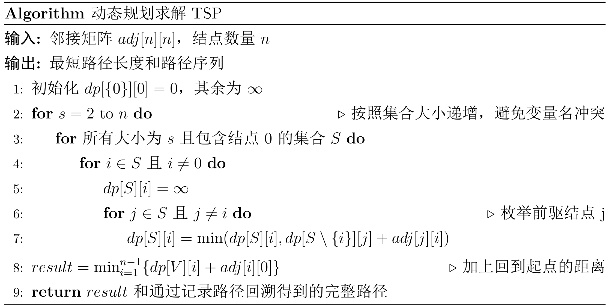

# ✅ 1. 子集和（Subset Sum）

### **优化子结构**

是否能用前 $i$ 个元素得到和 $j$，取决于：
- 如果$j>a[i]$: 是否能用前 $i-1$ 个元素得到和 $j-a[i]$
- 如果$j<a[i]$: 
  * 不选第 $i$ 个元素 → 是否能用前 $i-1$ 个元素得到 $j$
  * 选第 $i$ 个元素 → 是否能用前 $i-1$ 个元素得到 $j − a[i]$

### **重叠子问题**

不同路径会访问大量相同 (i, j)。

### **递归方程**

$$
dp[i][j] =
\begin{cases}
dp[i-1][j] \lor dp[i-1][j-a_i], & j\ge a_i\\
dp[i-1][j], & j < a_i
\end{cases}
$$

### **时间复杂度**

$O(nS)$，其中 S 为目标和。

### 问题类型与遍历方法
**存在类**问题
从前往后遍历，即$j$从0增长到$S$。

---

# ✅ 2. TSP —— 旅行商问题（Held–Karp DP）

### **优化子结构**

一般来说，假设某一优化解从0点到$i$点，那么该优化解遍历剩余节点的路径必然是从$i$点出发，途径剩余结点然后恰好回到0点的路径。因此，具有优化子结构

### **重叠子问题**

必然会多次求解从某结点$j$经过特点结点集合$V'$回到0点的子问题

### **递归方程**

设 dp[S][i] 表示从当前节点$i$出发，访问完 S，最后回到0点的最短路径：

$$
dp[S][i] = \min_{k \in S, k \neq i}\{ dp[S -  \{i\}][k] + w_{k,i}\}
$$

边界：
$$
dp[\{0\}][0] = 0
$$

### **时间复杂度**

$O(n^2 2^n)$

---

# ✅ 3. 带权区间调度（Weighted Interval Scheduling）

给区间 $i$：结束时间 $f_i$，权重 $v_i$，$p(i)$ 表示区间 $i$ 左侧，与 $i$ 相容的**结束时间最晚**的区间编号

### **优化子结构**

$OPT(n)$: 表示$a_1, a_2, \cdots, a_n$的优化解
最优调度要么：

* 不选区间 $i$ → 最优为 $OPT(i−1)$
* 选区间 $i$ → 最优为 $OPT(p(i)) + vᵢ$

### **重叠子问题**

$OPT(i)$ 和 $OPT(p(i))$ 在整个递归树重复出现。

### **递归方程**

区间按结束时间排序：

$$
OPT(i) = \max \left( OPT(i-1), v_i + OPT(p(i)) \right)
$$

### **时间复杂度**

O(n log n)（因为要二分查找 p(i)）
DP 本身 O(n)。

### 问题类型与遍历方法
**优化类**问题
从前往后遍历，即$i$从0增长到$n$。

---

# ✅ 4. 最长公共子序列（LCS）

X长度: m
Y长度: n

### **优化子结构**

比较 X[i] 和 Y[j]：

* 若相等 → LCS(i−1, j−1) + 1
* 若不等 → 从 LCS(i−1, j)、LCS(i, j−1) 中选较大

### **重叠子问题**

(i,j) 会被反复求解。

### **递归方程**

$dp[i][j]$表示序列$X_i$和$Y_j$的最长公共子序列长度
$$
dp[i][j] =
\begin{cases}
dp[i-1][j-1]+1, & X[i]=Y[j] \\
\max(dp[i-1][j], dp[i][j-1]), & X[i]\ne Y[j]
\end{cases}
$$

### 边界条件
$dp[0][j] = 0, \forall j$ 
$dp[i][0] = 0, \forall i$

### **时间复杂度**

$O(mn)$

### 问题类型与遍历方法
**优化类**问题
从前往后遍历，即$i$从1增长到$n$，对于每一个$i$, $j$从1增长到$m$。

---

# ✅ 5. 01背包问题

### **优化子结构**

如果$(x_1, x_2, \ldots, x_n)$ 是0/1原问题的优化解解，则$(x_2, x_3, \cdots, x_n)$是如下0/1背包问题的优化解：
$\text{max}\sum, \sum_{i=2}^{n} w_i x_i \leq C - w_1 x_1, x_i \in\{0,1\}, 2\leq i\leq n$

### **重叠子问题**

dp[i, w] 多次被访问。

### **递归方程**

$$
dp[i][w] =
\begin{cases}
dp[i+1][w], & w < w_i \\
\max(dp[i+1][w], dp[i+1][w-w_i] + v_i) & w \geq w_i
\end{cases}
$$

### **边界条件**
$$
dp[n][w] = 
\begin{cases}
0, & 0 \leq w < w_n \\
v_n, &  w \geq w_n
\end{cases}
$$

### **时间复杂度**

$O(nW)$

### 问题类型与遍历方法
**优化类**问题
从后往前遍历，$i$从$n-1$降低到0（对于每一个$i$, $j$: $0\sim W$ or $W \sim 0$）。

---

# ✅ 6. 区间 DP（典型如矩阵链乘 MCM）

### **优化子结构**

最优划分 $i\cdots j$ =
$\min\{\text{cost}(i, k) + \text{cost}(k+1,j) + \text{merge\_cost}(i, k, j)\}$
cost(i,k) + cost(k+1,j) + 合并代价

### **重叠子问题**

dp[i][j] 会被多次计算。

### **递归方程**

以矩阵链乘为例：

$$
dp[i][j] = \min_{i\le k < j} { dp[i][k] + dp[k+1][j] + cost(i,k,j) }
$$

### **时间复杂度**

$$O(n^3)$$

### 问题类型与遍历方法
**优化类**问题
从小区间遍历到大区间，即$[i, j]$的长度从小到大，对于每一种固定长度，要考虑所有$[i, j]$

---

