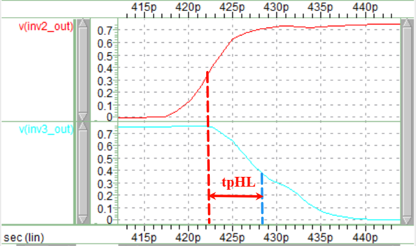
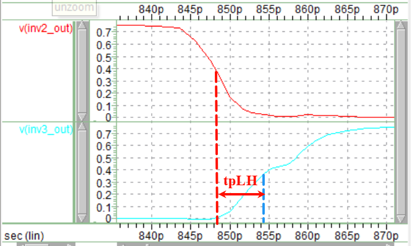
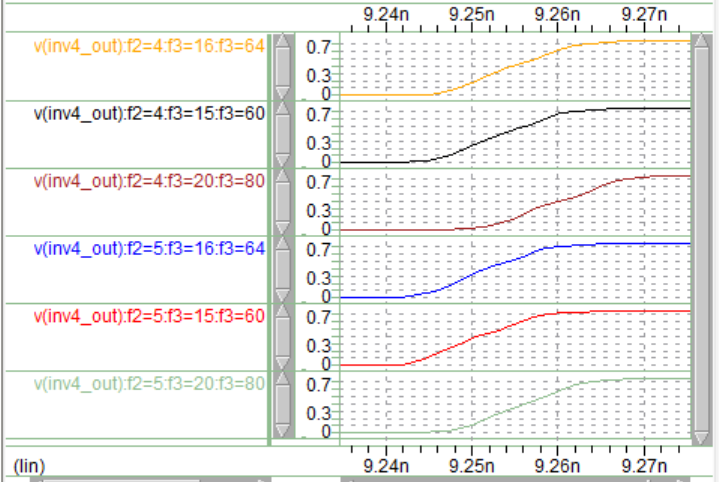
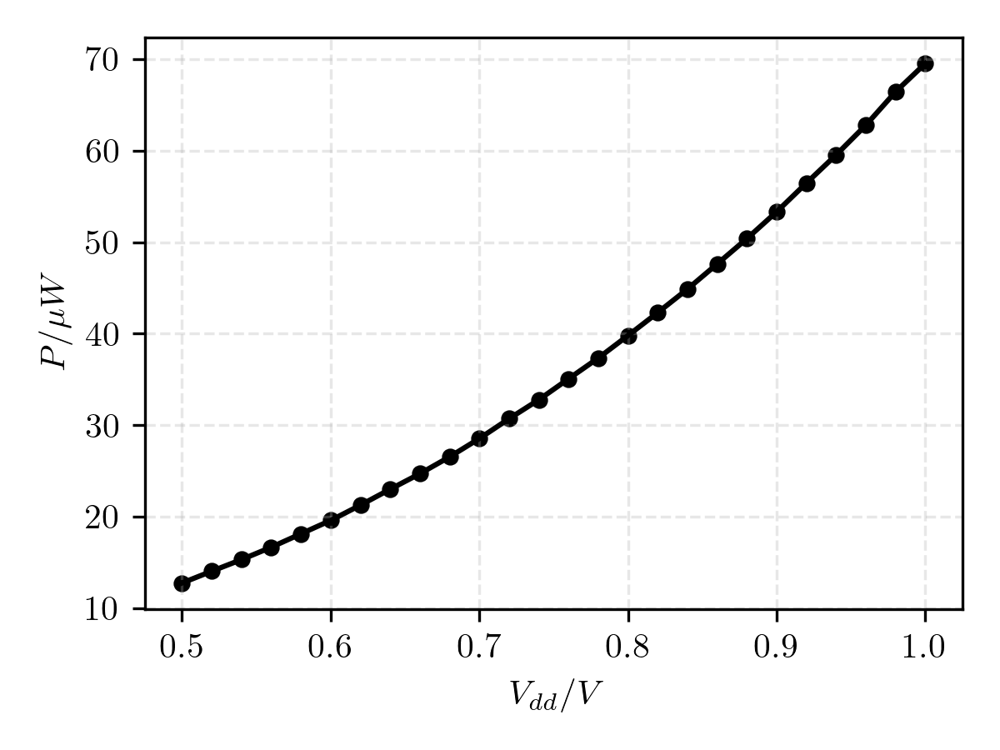
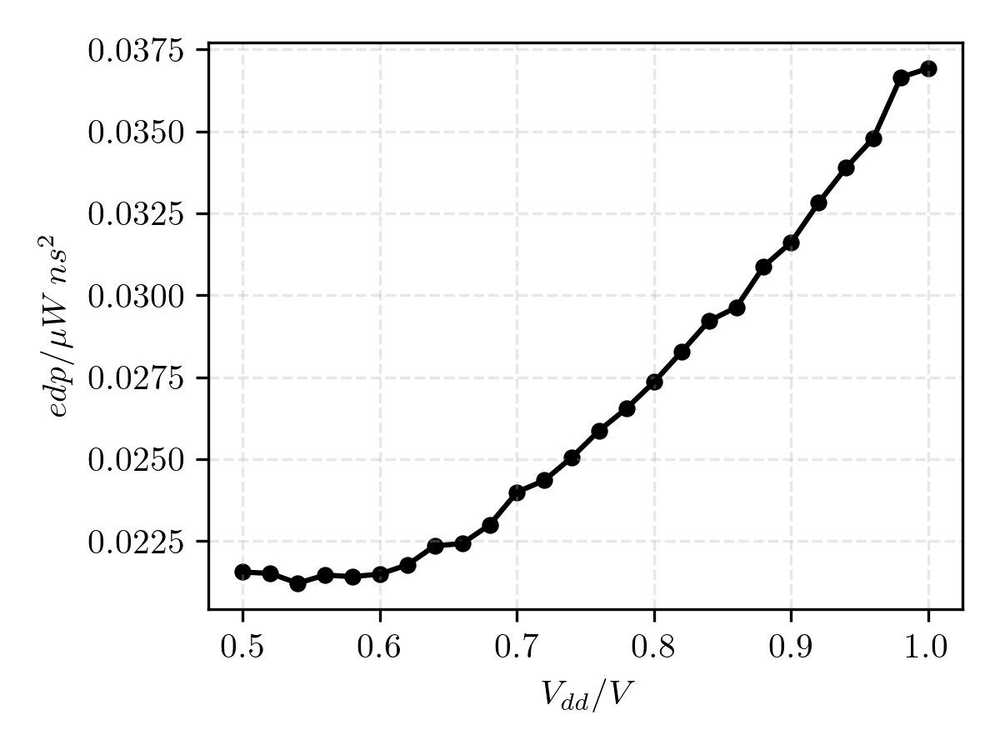
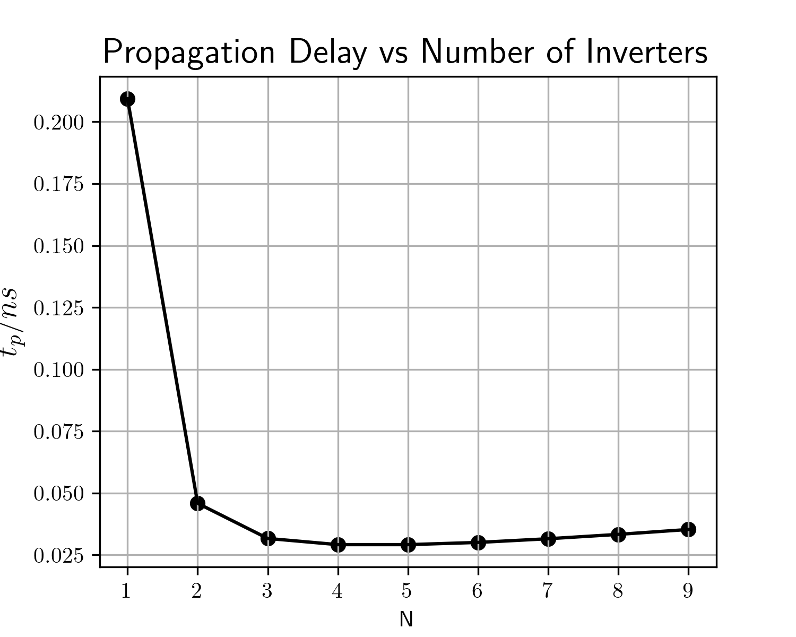

# DIC Lab2 任务书

## Task1
Task: Measure FO4 delay (tpLH, tpHL, tp) of inverter

测量得到第三个反相器的时延参数：
```spice
$DATA1 SOURCE='HSPICE' VERSION='L-2016.03-2 win64' PARAM_COUNT=0
.TITLE '*****************************************************'
 tplh             tphl             tp               temper          
 alter#          
  6.190e-012       5.633e-012       5.911e-012        25.0000       
1               
```
tpHL的测量波形图见图：

tpLH的测量波形图如图：



## Task2: Delay Optimization for Inverter Chain

Task: For a inverter chain with 4 stages and 256X Cload(256X inverter), find the minimum delay chain design
设置的参数为：
```spice
.data sweepdata f2 f3 f3
+ 4 16 64
+ 4 15 60
+ 4 20 80
+ 5 16 64
+ 5 15 60
+ 5 20 80
```

反相器链的连接情况为：
```spice
* Connet subckt
Xinv1 in inv1_out vdd 0 inv nfin = 1
Xinv2 inv1_out inv2_out vdd 0 inv nfin = 'f2'
Xinv3 inv2_out inv3_out vdd 0 inv nfin = 'f3'
Xinv4 inv3_out inv4_out vdd 0 inv nfin = 'f4'
XinvL inv4_out invL_out vdd 0 inv nfin = 256
```

其中f2, f3, f4分别是四级反相器链中，第二个、第三个、第四个反相器的尺寸因子，在本实验的情况下体现为FinFET的Fin个数。此外，题目默认第一个反相器的尺寸因子为1，负载反相器（256X inverter）的尺寸因子为256
测量语句：
```spice
.measure tran tpLH1 TRIG V(in) = '0.5*SUPPLY' FALL = 2  TARG V(inv1_out) = '0.5*SUPPLY' RISE = 2
.measure tran tpHL1 TRIG V(in) = '0.5*SUPPLY' RISE = 2  TARG V(inv1_out) = '0.5*SUPPLY' FALL = 2
.measure tran tp1 param='(tpLH1+tpHL1)/2'

.measure tran tpLH2 TRIG V(inv1_out) = '0.5*SUPPLY' FALL = 2  TARG V(inv2_out) = '0.5*SUPPLY' RISE = 2
.measure tran tpHL2 TRIG V(inv1_out) = '0.5*SUPPLY' RISE = 2  TARG V(inv2_out) = '0.5*SUPPLY' FALL = 2
.measure tran tp2 param='(tpLH2+tpHL2)/2'

.measure tran tpLH3 TRIG V(inv2_out) = '0.5*SUPPLY' FALL = 2  TARG V(inv3_out) = '0.5*SUPPLY' RISE = 2
.measure tran tpHL3 TRIG V(inv2_out) = '0.5*SUPPLY' RISE = 2  TARG V(inv3_out) = '0.5*SUPPLY' FALL = 2
.measure tran tp3 param='(tpLH3+tpHL3)/2'

.measure tran tpLH4 TRIG V(inv3_out) = '0.5*SUPPLY' FALL = 2  TARG V(inv4_out) = '0.5*SUPPLY' RISE = 2
.measure tran tpHL4 TRIG V(inv3_out) = '0.5*SUPPLY' RISE = 2  TARG V(inv4_out) = '0.5*SUPPLY' FALL = 2
.measure tran tp4 param='(tpLH4+tpHL4)/2'

.measure tran tp_total param='tp1+tp2+tp3+tp4'
```
测量得到的结果为：task2.mt0:
```spice
$DATA1 SOURCE='HSPICE' VERSION='L-2016.03-2 win64' PARAM_COUNT=4
.TITLE '*****************************************************'
 index            f2               f3               f3              
                  tplh1            tphl1            tp1             
                  tplh2            tphl2            tp2             
                  tplh3            tphl3            tp3             
                  tplh4            tphl4            tp4             
                  tp_total         temper           alter#          
 1                   4.0000          16.0000          64.0000       
                   8.760e-012       7.959e-012       8.360e-012     
                   2.010e-011       1.762e-011       1.886e-011     
                   6.522e-012       5.460e-012       5.991e-012     
                   8.421e-012       7.054e-012       7.738e-012     
                   4.095e-011        25.0000        1               
 2                   4.0000          15.0000          60.0000       
                   8.752e-012       7.837e-012       8.295e-012     
                   1.898e-011       1.654e-011       1.776e-011     
                   6.531e-012       5.494e-012       6.012e-012     
                   8.342e-012       7.227e-012       7.785e-012     
                   3.986e-011        25.0000        1               
 3                   4.0000          20.0000          80.0000       
                   8.741e-012       8.116e-012       8.428e-012     
                   2.427e-011       2.103e-011       2.265e-011     
                   7.162e-012       5.696e-012       6.429e-012     
                   8.647e-012       7.211e-012       7.929e-012     
                   4.543e-011        25.0000        1               
 4                   5.0000          16.0000          64.0000       
                   9.935e-012       8.942e-012       9.439e-012     
                   1.678e-011       1.499e-011       1.588e-011     
                   6.043e-012       5.158e-012       5.600e-012     
                   7.837e-012       6.674e-012       7.255e-012     
                   3.818e-011        25.0000        1               
 5                   5.0000          15.0000          60.0000       
                   1.003e-011       8.956e-012       9.492e-012     
                   1.589e-011       1.428e-011       1.509e-011     
                   5.821e-012       5.190e-012       5.506e-012     
                   7.631e-012       6.846e-012       7.238e-012     
                   3.732e-011        25.0000        1               
 6                   5.0000          20.0000          80.0000       
                   9.895e-012       8.932e-012       9.414e-012     
                   2.042e-011       1.789e-011       1.916e-011     
                   6.435e-012       5.090e-012       5.762e-012     
                   8.273e-012       6.619e-012       7.446e-012     
                   4.178e-011        25.0000        1               
         
```         

可以发现，与教材中的结论$f = F^{\frac{1}{N}}$不同的是，$f_2 = 4, f_3 = 4f_2 = 16, f_4=4f_3=64$的尺寸组合的反相器并没有得到最优延迟，得到最优反相器链延迟组合的是$f_2 = 5, f_3 = 15, f_4=60$
时域波形图佐证：

原因分析：待补充


## Task3: CMOS Inverter Power
Task: Measure the power of inverter chain in Task2 
➢ Only include the power consumption of inverter chain
➢ Apply a pulse voltage on the input node and measure the power averaging
for multiple cycles
The chain size should use the optimum values you have found

So, Let f2 = 5, f3 = 15, f4 = 60
关键测量语句：
```spice
.MEASURE TRAN avgpower AVG P(vdd_inv) from=1n to=10n
```
测量结果：task3.mt0
```spice
$DATA1 SOURCE='HSPICE' VERSION='L-2016.03-2 win64' PARAM_COUNT=0
.TITLE '*****************************************************'
 avgpower         temper           alter#          
 -3.320e-005        25.0000        1               
```


## Task4: DP measurement
Task: Using optimized chain to find optimal point of Energy and delay
Hint:
• To find ensure your results, you can sweep the VDD beyond the standard supply
• Ultral-low VDD may result in unfunctional circuit

Use function to measure EDP
.measure tran edp param='abs(avgpower*tp*tp)'

测量语句：
```spice
.probe tran V(*) I(*)
.measure tran tpLH1 TRIG V(in) = '0.5*SUPPLY' FALL = 2  TARG V(inv1_out) = '0.5*SUPPLY' RISE = 2
.measure tran tpHL1 TRIG V(in) = '0.5*SUPPLY' RISE = 2  TARG V(inv1_out) = '0.5*SUPPLY' FALL = 2
.measure tran tp1 param='(tpLH1+tpHL1)/2'

.measure tran tpLH2 TRIG V(inv1_out) = '0.5*SUPPLY' FALL = 2  TARG V(inv2_out) = '0.5*SUPPLY' RISE = 2
.measure tran tpHL2 TRIG V(inv1_out) = '0.5*SUPPLY' RISE = 2  TARG V(inv2_out) = '0.5*SUPPLY' FALL = 2
.measure tran tp2 param='(tpLH2+tpHL2)/2'

.measure tran tpLH3 TRIG V(inv2_out) = '0.5*SUPPLY' FALL = 2  TARG V(inv3_out) = '0.5*SUPPLY' RISE = 2
.measure tran tpHL3 TRIG V(inv2_out) = '0.5*SUPPLY' RISE = 2  TARG V(inv3_out) = '0.5*SUPPLY' FALL = 2
.measure tran tp3 param='(tpLH3+tpHL3)/2'

.measure tran tpLH4 TRIG V(inv3_out) = '0.5*SUPPLY' FALL = 2  TARG V(inv4_out) = '0.5*SUPPLY' RISE = 2
.measure tran tpHL4 TRIG V(inv3_out) = '0.5*SUPPLY' RISE = 2  TARG V(inv4_out) = '0.5*SUPPLY' FALL = 2
.measure tran tp4 param='(tpLH4+tpHL4)/2'

.measure tran tp_total param='tp1+tp2+tp3+tp4'

.measure TRAN avgpower AVG P(vdd_inv) from=1n to=8n
.measure tran EDP param='abs(avgpower*tp_total*tp_total)'
```
测量结果为：task4.mt0：
```spice
$DATA1 SOURCE='HSPICE' VERSION='L-2016.03-2 win64' PARAM_COUNT=1
.TITLE '*****************************************************'
 supply           tplh1            tphl1            tp1             
                  tplh2            tphl2            tp2             
                  tplh3            tphl3            tp3             
                  tplh4            tphl4            tp4             
                  tp_total         avgpower         edp             
                  temper           alter#          
    0.5000         1.353e-011       1.234e-011       1.294e-011     
                   9.709e-012       9.879e-012       9.794e-012     
                   1.035e-011       9.927e-012       1.014e-011     
                   6.975e-012       9.558e-012       8.267e-012     
                   4.114e-011      -1.274e-005       2.155e-026     
                    25.0000        1               
    0.5200         1.322e-011       1.194e-011       1.258e-011     
                   9.178e-012       9.095e-012       9.136e-012     
                   9.949e-012       9.397e-012       9.673e-012     
                   6.654e-012       8.883e-012       7.769e-012     
                   3.915e-011      -1.403e-005       2.151e-026     
                    25.0000        1               
    0.5400         1.276e-011       1.165e-011       1.220e-011     
                   8.535e-012       8.501e-012       8.518e-012     
                   9.482e-012       9.019e-012       9.250e-012     
                   6.115e-012       8.401e-012       7.258e-012     
                   3.723e-011      -1.530e-005       2.121e-026     
                    25.0000        1               
    0.5600         1.258e-011       1.135e-011       1.196e-011     
                   8.242e-012       8.061e-012       8.151e-012     
                   9.046e-012       8.495e-012       8.771e-012     
                   6.029e-012       8.000e-012       7.014e-012     
                   3.590e-011      -1.665e-005       2.146e-026     
                    25.0000        1               
    0.5800         1.190e-011       1.114e-011       1.152e-011     
                   7.738e-012       7.719e-012       7.728e-012     
                   8.662e-012       8.193e-012       8.428e-012     
                   5.719e-012       7.683e-012       6.701e-012     
                   3.437e-011      -1.812e-005       2.141e-026     
                    25.0000        1               
    0.6000         1.170e-011       1.078e-011       1.124e-011     
                   7.568e-012       7.394e-012       7.481e-012     
                   8.352e-012       7.927e-012       8.139e-012     
                   5.428e-012       7.122e-012       6.275e-012     
                   3.314e-011      -1.958e-005       2.149e-026     
                    25.0000        1               
    0.6200         1.137e-011       1.035e-011       1.086e-011     
                   7.251e-012       7.105e-012       7.178e-012     
                   8.065e-012       7.598e-012       7.832e-012     
                   5.415e-012       6.855e-012       6.135e-012     
                   3.201e-011      -2.125e-005       2.177e-026     
                    25.0000        1               
    0.6400         1.118e-011       1.032e-011       1.075e-011     
                   6.976e-012       6.845e-012       6.910e-012     
                   7.730e-012       7.412e-012       7.571e-012     
                   5.205e-012       6.692e-012       5.949e-012     
                   3.118e-011      -2.299e-005       2.235e-026     
                    25.0000        1               
    0.6600         1.090e-011       1.012e-011       1.051e-011     
                   6.549e-012       6.481e-012       6.515e-012     
                   7.559e-012       7.215e-012       7.387e-012     
                   5.010e-012       6.431e-012       5.720e-012     
                   3.013e-011      -2.469e-005       2.242e-026     
                    25.0000        1               
    0.6800         1.076e-011       1.005e-011       1.040e-011     
                   6.256e-012       6.250e-012       6.253e-012     
                   7.325e-012       6.985e-012       7.155e-012     
                   4.961e-012       6.297e-012       5.629e-012     
                   2.944e-011      -2.653e-005       2.299e-026     
                    25.0000        1               
    0.7000         1.078e-011       9.772e-012       1.028e-011     
                   6.288e-012       5.996e-012       6.142e-012     
                   7.198e-012       6.718e-012       6.958e-012     
                   5.033e-012       6.207e-012       5.620e-012     
                   2.900e-011      -2.853e-005       2.399e-026     
                    25.0000        1               
    0.7200         1.032e-011       9.685e-012       1.000e-011     
                   5.950e-012       5.951e-012       5.950e-012     
                   6.992e-012       6.544e-012       6.768e-012     
                   4.860e-012       6.026e-012       5.443e-012     
                   2.816e-011      -3.070e-005       2.435e-026     
                    25.0000        1               
    0.7400         1.039e-011       9.144e-012       9.768e-012     
                   6.297e-012       5.619e-012       5.958e-012     
                   6.883e-012       6.435e-012       6.659e-012     
                   4.736e-012       5.783e-012       5.260e-012     
                   2.765e-011      -3.277e-005       2.505e-026     
                    25.0000        1               
    0.7600         1.002e-011       9.275e-012       9.650e-012     
                   5.850e-012       5.755e-012       5.802e-012     
                   6.692e-012       6.322e-012       6.507e-012     
                   4.667e-012       5.742e-012       5.205e-012     
                   2.716e-011      -3.506e-005       2.587e-026     
                    25.0000        1               
    0.7800         9.884e-012       9.143e-012       9.514e-012     
                   5.715e-012       5.663e-012       5.689e-012     
                   6.574e-012       6.162e-012       6.368e-012     
                   4.616e-012       5.571e-012       5.094e-012     
                   2.667e-011      -3.733e-005       2.655e-026     
                    25.0000        1               
    0.8000         1.013e-011       8.669e-012       9.398e-012     
                   6.123e-012       5.154e-012       5.638e-012     
                   6.389e-012       5.950e-012       6.169e-012     
                   4.663e-012       5.355e-012       5.009e-012     
                   2.621e-011      -3.979e-005       2.735e-026     
                    25.0000        1               
    0.8200         9.778e-012       8.547e-012       9.163e-012     
                   6.053e-012       5.279e-012       5.666e-012     
                   6.271e-012       5.853e-012       6.062e-012     
                   4.665e-012       5.254e-012       4.959e-012     
                   2.585e-011      -4.230e-005       2.827e-026     
                    25.0000        1               
    0.8400         9.981e-012       8.466e-012       9.224e-012     
                   5.905e-012       4.944e-012       5.425e-012     
                   6.136e-012       5.773e-012       5.954e-012     
                   4.638e-012       5.183e-012       4.910e-012     
                   2.551e-011      -4.487e-005       2.921e-026     
                    25.0000        1               
    0.8600         9.342e-012       8.533e-012       8.938e-012     
                   5.508e-012       5.328e-012       5.418e-012     
                   6.041e-012       5.696e-012       5.869e-012     
                   4.356e-012       5.078e-012       4.717e-012     
                   2.494e-011      -4.762e-005       2.963e-026     
                    25.0000        1               
    0.8800         9.717e-012       8.559e-012       9.138e-012     
                   5.288e-012       4.855e-012       5.072e-012     
                   5.977e-012       5.634e-012       5.806e-012     
                   4.407e-012       5.069e-012       4.738e-012     
                   2.475e-011      -5.039e-005       3.088e-026     
                    25.0000        1               
    0.9000         9.125e-012       8.317e-012       8.721e-012     
                   5.377e-012       5.216e-012       5.296e-012     
                   5.847e-012       5.494e-012       5.671e-012     
                   4.382e-012       4.937e-012       4.659e-012     
                   2.435e-011      -5.332e-005       3.161e-026     
                    25.0000        1               
    0.9200         9.264e-012       8.062e-012       8.663e-012     
                   5.615e-012       4.865e-012       5.240e-012     
                   5.860e-012       5.398e-012       5.629e-012     
                   4.317e-012       4.840e-012       4.579e-012     
                   2.411e-011      -5.646e-005       3.282e-026     
                    25.0000        1               
    0.9400         9.587e-012       8.057e-012       8.822e-012     
                   5.372e-012       4.602e-012       4.987e-012     
                   5.797e-012       5.255e-012       5.526e-012     
                   4.282e-012       4.765e-012       4.524e-012     
                   2.386e-011      -5.954e-005       3.389e-026     
                    25.0000        1               
    0.9600         9.125e-012       8.085e-012       8.605e-012     
                   5.138e-012       4.910e-012       5.024e-012     
                   5.711e-012       5.148e-012       5.430e-012     
                   4.239e-012       4.719e-012       4.479e-012     
                   2.354e-011      -6.279e-005       3.479e-026     
                    25.0000        1               
    0.9800         8.833e-012       8.022e-012       8.427e-012     
                   5.339e-012       5.029e-012       5.184e-012     
                   5.642e-012       5.280e-012       5.461e-012     
                   4.183e-012       4.643e-012       4.413e-012     
                   2.349e-011      -6.644e-005       3.665e-026     
                    25.0000        1               
    1.0000         8.905e-012       7.918e-012       8.412e-012     
                   5.044e-012       4.896e-012       4.970e-012     
                   5.574e-012       4.972e-012       5.273e-012     
                   4.218e-012       4.556e-012       4.387e-012     
                   2.304e-011      -6.953e-005       3.692e-026     
                    25.0000        1              
```
数据结果已经利用Lab2/parser_mt.py整理至task4.xlsx(纯提取，无其余操作)，然后利用Lab2/Task4/summary_plot.py读取task4.xlsx文件，读取关键指标tp_total, avgpower, edp，并绘制与电压的关系曲线图：
tp_total - volts: 

avgpower - volts:

edp - volts:



从表格中可见，具有最低EDP值的SUPPLY为0.58V，对应的edp值为2.141e-026 W s^2
原因分析：待补充


## Task 5 (Optional): Inverter chain optimization with unfixed stages
For a given Initial stage and Cload, find the minimum delay chain design
Find: Optimize Stage Number and Size of each stage
Design the optimum delay chain by FinFET technology, the first inverter: 1×. Cload: implemented by a 256×inverter


• For a given stage N, the optimum f is determined by f = F^{F}
• Sweep the N to find corresponding f
• In theory, the optimum f should satisfy: f = exp(1+f)

实现方法：
不同N的反相器链，其反相器个数以及各级反相器尺寸参数Nfin有所不同，因此难以用一个sp脚本调整不同N值得到不同反相器链。
因此，我们利用python脚本Lab2/Task5/generate_task5.py在文件夹Task5下生成多个名为N=1,2,...的文件夹，每一个文件夹下包含对应N值的sp脚本。然后利用python脚本Lab2/Task5/run_task5.py批量运行这些sp脚本，得到.mt0文件。然后利用Lab2/parser_mt.py脚本解析所有.mt0文件。最后利用python脚本Lab2/Task5/run_stat.py脚本读取生成的task5_N*.sp，整理不同N值得tp_total参数到summary.xlsx
```
N	tp_total
1	2.088E-10
10	3.695E-11
2	4.643E-11
3	3.196E-11
4	2.963E-11
5	2.912E-11
6	3.034E-11
7	3.182E-11
8	3.302E-11
9	3.487E-11
```
然后利用python脚本Lab2/Task5/summary_plot脚本作图，得到tp_total-N曲线图如下：

可见，当$N=5$时，此时反相器链的总体延迟最小，约为2.912E-11s

原因分析：