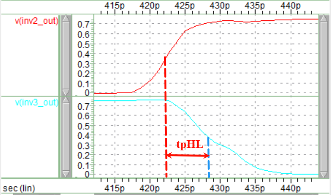
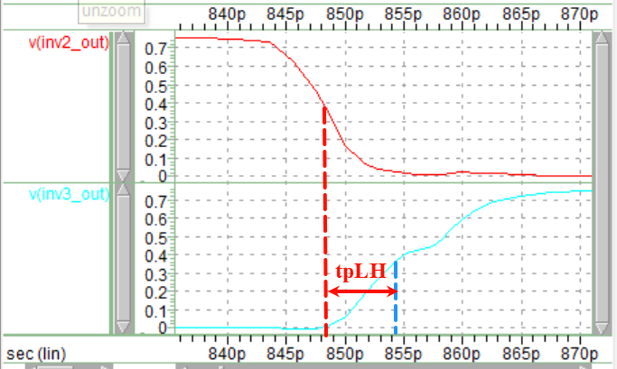
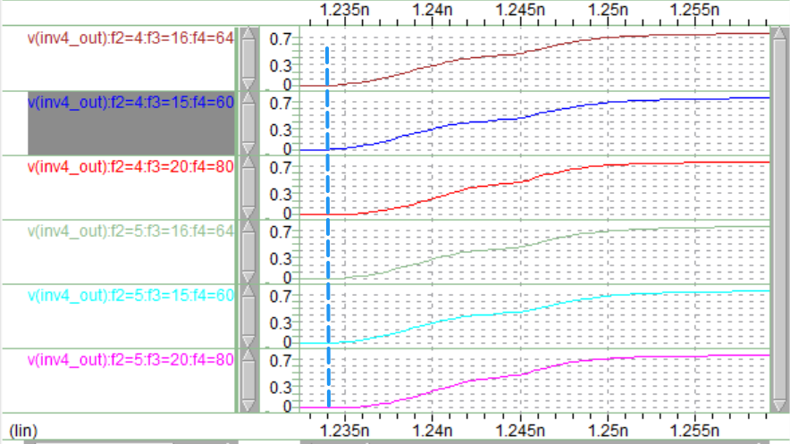
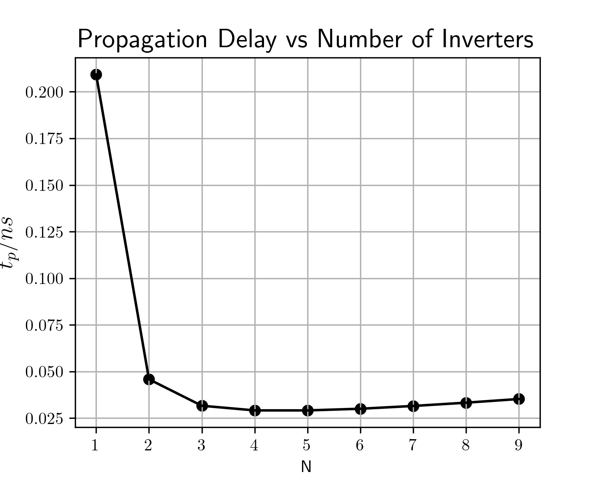

# DIC Lab2 任务书

## Task1
Task: Measure FO4 delay (tpLH, tpHL, tp) of inverter

测量得到第三个反相器的时延参数：
```spice
$DATA1 SOURCE='HSPICE' VERSION='L-2016.03-2 win64' PARAM_COUNT=0
.TITLE '*****************************************************'
 tplh             tphl             tp               temper          
 alter#          
  6.212e-012       5.680e-012       5.946e-012        25.0000       
1                  
```
tpHL的测量波形图见图：

tpLH的测量波形图如图：



## Task2: Delay Optimization for Inverter Chain

Task: For a inverter chain with 4 stages and 256X Cload(256X inverter), find the minimum delay chain design
设置的参数为：
```spice
.data sweepdata f2 f3 f4
+ 4 16 64
+ 4 15 60
+ 4 20 80
+ 5 16 64
+ 5 15 60
+ 5 20 80
```

反相器链的连接情况为：
```spice
* Connet subckt
Xinv1 in inv1_out vdd 0 inv nfin = 1
Xinv2 inv1_out inv2_out vdd 0 inv nfin = 'f2'
Xinv3 inv2_out inv3_out vdd 0 inv nfin = 'f3'
Xinv4 inv3_out inv4_out vdd 0 inv nfin = 'f4'
XinvL inv4_out invL_out vdd 0 inv nfin = 256
```

其中f2, f3, f4分别是四级反相器链中，第二个、第三个、第四个反相器的尺寸因子，在本实验的情况下体现为FinFET的Fin个数。此外，题目默认第一个反相器的尺寸因子为1，负载反相器（256X inverter）的尺寸因子为256
测量语句：
```spice
.measure tran tpLH1 TRIG V(in) = '0.5*SUPPLY' FALL = 2  TARG V(inv1_out) = '0.5*SUPPLY' RISE = 2
.measure tran tpHL1 TRIG V(in) = '0.5*SUPPLY' RISE = 2  TARG V(inv1_out) = '0.5*SUPPLY' FALL = 2
.measure tran tp1 param='(tpLH1+tpHL1)/2'

.measure tran tpLH2 TRIG V(inv1_out) = '0.5*SUPPLY' FALL = 2  TARG V(inv2_out) = '0.5*SUPPLY' RISE = 2
.measure tran tpHL2 TRIG V(inv1_out) = '0.5*SUPPLY' RISE = 2  TARG V(inv2_out) = '0.5*SUPPLY' FALL = 2
.measure tran tp2 param='(tpLH2+tpHL2)/2'

.measure tran tpLH3 TRIG V(inv2_out) = '0.5*SUPPLY' FALL = 2  TARG V(inv3_out) = '0.5*SUPPLY' RISE = 2
.measure tran tpHL3 TRIG V(inv2_out) = '0.5*SUPPLY' RISE = 2  TARG V(inv3_out) = '0.5*SUPPLY' FALL = 2
.measure tran tp3 param='(tpLH3+tpHL3)/2'

.measure tran tpLH4 TRIG V(inv3_out) = '0.5*SUPPLY' FALL = 2  TARG V(inv4_out) = '0.5*SUPPLY' RISE = 2
.measure tran tpHL4 TRIG V(inv3_out) = '0.5*SUPPLY' RISE = 2  TARG V(inv4_out) = '0.5*SUPPLY' FALL = 2
.measure tran tp4 param='(tpLH4+tpHL4)/2'

.measure tran tp_total param='tp1+tp2+tp3+tp4'
```
测量得到的结果为：task2.mt0:
```spice
$DATA1 SOURCE='HSPICE' VERSION='L-2016.03-2 win64' PARAM_COUNT=4
.TITLE '*****************************************************'
 index            f2               f3               f4              
                  tplh1            tphl1            tp1             
                  tplh2            tphl2            tp2             
                  tplh3            tphl3            tp3             
                  tplh4            tphl4            tp4             
                  tp_total         temper           alter#          
 1                   4.0000          16.0000          64.0000       
                   9.125e-012       8.113e-012       8.619e-012     
                   6.987e-012       6.585e-012       6.786e-012     
                   6.930e-012       6.573e-012       6.752e-012     
                   7.279e-012       6.740e-012       7.009e-012     
                   2.917e-011        25.0000        1               
 2                   4.0000          15.0000          60.0000       
                   9.114e-012       8.100e-012       8.607e-012     
                   6.741e-012       6.355e-012       6.548e-012     
                   6.828e-012       6.459e-012       6.644e-012     
                   7.556e-012       6.985e-012       7.271e-012     
                   2.907e-011        25.0000        1               
 3                   4.0000          20.0000          80.0000       
                   9.103e-012       8.100e-012       8.602e-012     
                   7.975e-012       7.503e-012       7.739e-012     
                   7.365e-012       7.010e-012       7.188e-012     
                   6.468e-012       5.995e-012       6.232e-012     
                   2.976e-011        25.0000        1               
 4                   5.0000          16.0000          64.0000       
                   1.030e-011       9.197e-012       9.749e-012     
                   6.463e-012       6.096e-012       6.279e-012     
                   6.685e-012       6.269e-012       6.477e-012     
                   7.217e-012       6.700e-012       6.958e-012     
                   2.946e-011        25.0000        1               
 5                   5.0000          15.0000          60.0000       
                   1.029e-011       9.218e-012       9.753e-012     
                   6.248e-012       5.893e-012       6.071e-012     
                   6.595e-012       6.175e-012       6.385e-012     
                   7.504e-012       6.952e-012       7.228e-012     
                   2.944e-011        25.0000        1               
 6                   5.0000          20.0000          80.0000       
                   1.025e-011       9.197e-012       9.723e-012     
                   7.283e-012       6.889e-012       7.086e-012     
                   7.045e-012       6.637e-012       6.841e-012     
                   6.385e-012       5.948e-012       6.166e-012     
                   2.982e-011        25.0000        1               

```         

可以发现，与教材中的结论$f = F^{\frac{1}{N}}$不同的是，$f_2 = 4, f_3 = 4f_2 = 16, f_4=4f_3=64$的尺寸组合的反相器并没有得到最优延迟，得到最优反相器链延迟组合的是$f_2 = 4, f_3 = 15, f_4=60$
时域波形图佐证：

原因分析：待补充


## Task3: CMOS Inverter Power
Task: Measure the power of inverter chain in Task2 
➢ Only include the power consumption of inverter chain
➢ Apply a pulse voltage on the input node and measure the power averaging
for multiple cycles
The chain size should use the optimum values you have found

So, Let f2 = 4, f3 = 15, f4 = 60
关键测量语句：
```spice
.MEASURE TRAN avgpower AVG P(vdd_inv) from=1n to=10n
```
测量结果：task3.mt0
```spice
$DATA1 SOURCE='HSPICE' VERSION='L-2016.03-2 win64' PARAM_COUNT=0
.TITLE '*****************************************************'
 avgpower         temper           alter#          
 -4.968e-005        25.0000        1                                  
```


## Task4: DP measurement
Task: Using optimized chain to find optimal point of Energy and delay
Hint:
• To find ensure your results, you can sweep the VDD beyond the standard supply
• Ultral-low VDD may result in unfunctional circuit

Use function to measure EDP
.measure tran edp param='abs(avgpower*tp*tp)'

测量语句：
```spice
.probe tran V(*) I(*)
.measure tran tpLH1 TRIG V(in) = '0.5*SUPPLY' FALL = 2  TARG V(inv1_out) = '0.5*SUPPLY' RISE = 2
.measure tran tpHL1 TRIG V(in) = '0.5*SUPPLY' RISE = 2  TARG V(inv1_out) = '0.5*SUPPLY' FALL = 2
.measure tran tp1 param='(tpLH1+tpHL1)/2'

.measure tran tpLH2 TRIG V(inv1_out) = '0.5*SUPPLY' FALL = 2  TARG V(inv2_out) = '0.5*SUPPLY' RISE = 2
.measure tran tpHL2 TRIG V(inv1_out) = '0.5*SUPPLY' RISE = 2  TARG V(inv2_out) = '0.5*SUPPLY' FALL = 2
.measure tran tp2 param='(tpLH2+tpHL2)/2'

.measure tran tpLH3 TRIG V(inv2_out) = '0.5*SUPPLY' FALL = 2  TARG V(inv3_out) = '0.5*SUPPLY' RISE = 2
.measure tran tpHL3 TRIG V(inv2_out) = '0.5*SUPPLY' RISE = 2  TARG V(inv3_out) = '0.5*SUPPLY' FALL = 2
.measure tran tp3 param='(tpLH3+tpHL3)/2'

.measure tran tpLH4 TRIG V(inv3_out) = '0.5*SUPPLY' FALL = 2  TARG V(inv4_out) = '0.5*SUPPLY' RISE = 2
.measure tran tpHL4 TRIG V(inv3_out) = '0.5*SUPPLY' RISE = 2  TARG V(inv4_out) = '0.5*SUPPLY' FALL = 2
.measure tran tp4 param='(tpLH4+tpHL4)/2'

.measure tran tp_total param='tp1+tp2+tp3+tp4'

.measure TRAN avgpower AVG P(vdd_inv) from=1n to=8n
.measure tran EDP param='abs(avgpower*tp_total*tp_total)'
```
测量结果为：task4.mt0：
```spice
$DATA1 SOURCE='HSPICE' VERSION='L-2016.03-2 win64' PARAM_COUNT=1
.TITLE '*****************************************************'
 supply           tplh1            tphl1            tp1             
                  tplh2            tphl2            tp2             
                  tplh3            tphl3            tp3             
                  tplh4            tphl4            tp4             
                  tp_total         avgpower         edp             
                  temper           alter#          
    0.5000         1.280e-011       1.173e-011       1.227e-011     
                   9.971e-012       9.763e-012       9.867e-012     
                   1.083e-011       1.042e-011       1.063e-011     
                   1.162e-011       1.106e-011       1.134e-011     
                   4.410e-011      -2.015e-005       3.918e-026     
                    25.0000        1               
    0.5200         1.234e-011       1.128e-011       1.181e-011     
                   9.456e-012       9.195e-012       9.326e-012     
                   1.021e-011       9.796e-012       1.000e-011     
                   1.100e-011       1.044e-011       1.072e-011     
                   4.186e-011      -2.203e-005       3.860e-026     
                    25.0000        1               
    0.5400         1.192e-011       1.087e-011       1.139e-011     
                   9.015e-012       8.719e-012       8.867e-012     
                   9.677e-012       9.274e-012       9.475e-012     
                   1.046e-011       9.894e-012       1.018e-011     
                   3.991e-011      -2.401e-005       3.825e-026     
                    25.0000        1               
    0.5600         1.152e-011       1.049e-011       1.100e-011     
                   8.649e-012       8.343e-012       8.496e-012     
                   9.223e-012       8.825e-012       9.024e-012     
                   9.994e-012       9.438e-012       9.716e-012     
                   3.824e-011      -2.610e-005       3.815e-026     
                    25.0000        1               
    0.5800         1.115e-011       1.012e-011       1.063e-011     
                   8.344e-012       8.008e-012       8.176e-012     
                   8.823e-012       8.427e-012       8.625e-012     
                   9.579e-012       9.026e-012       9.302e-012     
                   3.674e-011      -2.828e-005       3.817e-026     
                    25.0000        1               
    0.6000         1.083e-011       9.801e-012       1.032e-011     
                   8.073e-012       7.719e-012       7.896e-012     
                   8.477e-012       8.088e-012       8.283e-012     
                   9.237e-012       8.676e-012       8.956e-012     
                   3.545e-011      -3.058e-005       3.843e-026     
                    25.0000        1               
    0.6200         1.053e-011       9.506e-012       1.002e-011     
                   7.834e-012       7.458e-012       7.646e-012     
                   8.170e-012       7.787e-012       7.979e-012     
                   8.936e-012       8.360e-012       8.648e-012     
                   3.429e-011      -3.298e-005       3.878e-026     
                    25.0000        1               
    0.6400         1.026e-011       9.245e-012       9.752e-012     
                   7.612e-012       7.234e-012       7.423e-012     
                   7.900e-012       7.516e-012       7.708e-012     
                   8.653e-012       8.082e-012       8.367e-012     
                   3.325e-011      -3.548e-005       3.923e-026     
                    25.0000        1               
    0.6600         1.000e-011       8.996e-012       9.499e-012     
                   7.428e-012       7.046e-012       7.237e-012     
                   7.647e-012       7.279e-012       7.463e-012     
                   8.409e-012       7.829e-012       8.119e-012     
                   3.232e-011      -3.811e-005       3.980e-026     
                    25.0000        1               
    0.6800         9.794e-012       8.768e-012       9.281e-012     
                   7.249e-012       6.862e-012       7.055e-012     
                   7.439e-012       7.063e-012       7.251e-012     
                   8.179e-012       7.607e-012       7.893e-012     
                   3.148e-011      -4.084e-005       4.048e-026     
                    25.0000        1               
    0.7000         9.563e-012       8.578e-012       9.071e-012     
                   7.085e-012       6.704e-012       6.895e-012     
                   7.240e-012       6.869e-012       7.054e-012     
                   7.980e-012       7.411e-012       7.695e-012     
                   3.071e-011      -4.369e-005       4.122e-026     
                    25.0000        1               
    0.7200         9.391e-012       8.381e-012       8.886e-012     
                   6.941e-012       6.553e-012       6.747e-012     
                   7.067e-012       6.694e-012       6.881e-012     
                   7.802e-012       7.229e-012       7.515e-012     
                   3.003e-011      -4.664e-005       4.206e-026     
                    25.0000        1               
    0.7400         9.214e-012       8.202e-012       8.708e-012     
                   6.794e-012       6.415e-012       6.604e-012     
                   6.896e-012       6.534e-012       6.715e-012     
                   7.636e-012       7.059e-012       7.348e-012     
                   2.938e-011      -4.973e-005       4.291e-026     
                    25.0000        1               
    0.7600         9.033e-012       8.036e-012       8.534e-012     
                   6.673e-012       6.292e-012       6.483e-012     
                   6.751e-012       6.389e-012       6.570e-012     
                   7.481e-012       6.907e-012       7.194e-012     
                   2.878e-011      -5.290e-005       4.382e-026     
                    25.0000        1               
    0.7800         8.900e-012       7.886e-012       8.393e-012     
                   6.558e-012       6.169e-012       6.364e-012     
                   6.615e-012       6.255e-012       6.435e-012     
                   7.348e-012       6.773e-012       7.060e-012     
                   2.825e-011      -5.622e-005       4.488e-026     
                    25.0000        1               
    0.8000         8.746e-012       7.748e-012       8.247e-012     
                   6.438e-012       6.060e-012       6.249e-012     
                   6.495e-012       6.132e-012       6.314e-012     
                   7.219e-012       6.642e-012       6.931e-012     
                   2.774e-011      -5.964e-005       4.590e-026     
                    25.0000        1               
    0.8200         8.614e-012       7.619e-012       8.116e-012     
                   6.334e-012       5.957e-012       6.146e-012     
                   6.384e-012       6.021e-012       6.202e-012     
                   7.099e-012       6.526e-012       6.812e-012     
                   2.728e-011      -6.322e-005       4.703e-026     
                    25.0000        1               
    0.8400         8.517e-012       7.496e-012       8.006e-012     
                   6.240e-012       5.859e-012       6.049e-012     
                   6.280e-012       5.912e-012       6.096e-012     
                   6.995e-012       6.419e-012       6.707e-012     
                   2.686e-011      -6.690e-005       4.826e-026     
                    25.0000        1               
    0.8600         8.407e-012       7.382e-012       7.895e-012     
                   6.159e-012       5.768e-012       5.963e-012     
                   6.183e-012       5.820e-012       6.001e-012     
                   6.899e-012       6.320e-012       6.610e-012     
                   2.647e-011      -7.068e-005       4.952e-026     
                    25.0000        1               
    0.8800         8.279e-012       7.283e-012       7.781e-012     
                   6.069e-012       5.684e-012       5.877e-012     
                   6.095e-012       5.732e-012       5.914e-012     
                   6.805e-012       6.228e-012       6.517e-012     
                   2.609e-011      -7.461e-005       5.078e-026     
                    25.0000        1               
    0.9000         8.209e-012       7.187e-012       7.698e-012     
                   5.991e-012       5.602e-012       5.796e-012     
                   6.006e-012       5.650e-012       5.828e-012     
                   6.719e-012       6.146e-012       6.432e-012     
                   2.575e-011      -7.863e-005       5.215e-026     
                    25.0000        1               
    0.9200         8.126e-012       7.092e-012       7.609e-012     
                   5.925e-012       5.525e-012       5.725e-012     
                   5.933e-012       5.573e-012       5.753e-012     
                   6.638e-012       6.063e-012       6.351e-012     
                   2.544e-011      -8.277e-005       5.356e-026     
                    25.0000        1               
    0.9400         8.046e-012       7.002e-012       7.524e-012     
                   5.846e-012       5.453e-012       5.649e-012     
                   5.858e-012       5.501e-012       5.680e-012     
                   6.571e-012       5.990e-012       6.280e-012     
                   2.513e-011      -8.710e-005       5.502e-026     
                    25.0000        1               
    0.9600         7.975e-012       6.936e-012       7.455e-012     
                   5.782e-012       5.384e-012       5.583e-012     
                   5.793e-012       5.434e-012       5.614e-012     
                   6.504e-012       5.919e-012       6.212e-012     
                   2.486e-011      -9.151e-005       5.658e-026     
                    25.0000        1               
    0.9800         7.892e-012       6.863e-012       7.377e-012     
                   5.720e-012       5.325e-012       5.522e-012     
                   5.729e-012       5.372e-012       5.551e-012     
                   6.434e-012       5.854e-012       6.144e-012     
                   2.459e-011      -9.605e-005       5.810e-026     
                    25.0000        1               
    1.0000         7.839e-012       6.794e-012       7.316e-012     
                   5.663e-012       5.260e-012       5.461e-012     
                   5.671e-012       5.312e-012       5.492e-012     
                   6.375e-012       5.811e-012       6.093e-012     
                   2.436e-011      -1.007e-004       5.978e-026     
                    25.0000        1               
    1.0200         7.772e-012       6.732e-012       7.252e-012     
                   5.610e-012       5.208e-012       5.409e-012     
                   5.616e-012       5.255e-012       5.436e-012     
                   6.319e-012       5.741e-012       6.030e-012     
                   2.413e-011      -1.056e-004       6.148e-026     
                    25.0000        1               
    1.0400         7.714e-012       6.677e-012       7.195e-012     
                   5.554e-012       5.155e-012       5.354e-012     
                   5.563e-012       5.203e-012       5.383e-012     
                   6.266e-012       5.697e-012       5.982e-012     
                   2.391e-011      -1.106e-004       6.328e-026     
                    25.0000        1               
    1.0600         7.665e-012       6.619e-012       7.142e-012     
                   5.502e-012       5.105e-012       5.303e-012     
                   5.515e-012       5.155e-012       5.335e-012     
                   6.217e-012       5.632e-012       5.924e-012     
                   2.370e-011      -1.160e-004       6.519e-026     
                    25.0000        1               
    1.0800         7.617e-012       6.564e-012       7.091e-012     
                   5.463e-012       5.056e-012       5.260e-012     
                   5.468e-012       5.108e-012       5.288e-012     
                   6.171e-012       5.589e-012       5.880e-012     
                   2.352e-011      -1.224e-004       6.769e-026     
                    25.0000        1               
    1.1000         7.572e-012       6.511e-012       7.042e-012     
                   5.421e-012       5.009e-012       5.215e-012     
                   5.425e-012       5.062e-012       5.243e-012     
                   6.120e-012       5.537e-012       5.829e-012     
                   2.333e-011      -1.319e-004       7.180e-026     
                    25.0000        1               
    1.1200         7.533e-012       6.459e-012       6.996e-012     
                   5.378e-012       4.959e-012       5.168e-012     
                   5.381e-012       5.014e-012       5.198e-012     
                   6.080e-012       5.489e-012       5.784e-012     
                   2.315e-011      -1.523e-004       8.161e-026     
                    25.0000        1               
    1.1400         7.484e-012       6.406e-012       6.945e-012     
                   5.335e-012       4.909e-012       5.122e-012     
                   5.335e-012       4.959e-012       5.147e-012     
                   6.027e-012       5.433e-012       5.730e-012     
                   2.294e-011      -2.007e-004       1.057e-025     
                    25.0000        1               
    1.1600         7.426e-012       6.344e-012       6.885e-012     
                   5.288e-012       4.856e-012       5.072e-012     
                   5.279e-012       4.894e-012       5.086e-012     
                   5.964e-012       5.357e-012       5.660e-012     
                   2.270e-011      -2.946e-004       1.519e-025     
                    25.0000        1               
    1.1800         7.364e-012       6.280e-012       6.822e-012     
                   5.238e-012       4.800e-012       5.019e-012     
                   5.217e-012       4.826e-012       5.022e-012     
                   5.895e-012       5.277e-012       5.586e-012     
                   2.245e-011      -4.348e-004       2.191e-025     
                    25.0000        1               
    1.2000         7.302e-012       6.213e-012       6.758e-012     
                   5.186e-012       4.739e-012       4.962e-012     
                   5.154e-012       4.755e-012       4.954e-012     
                   5.816e-012       5.196e-012       5.506e-012     
                   2.218e-011      -6.114e-004       3.008e-025     
                    25.0000        1               
    1.2200         7.244e-012       6.145e-012       6.694e-012     
                   5.137e-012       4.677e-012       4.907e-012     
                   5.090e-012       4.686e-012       4.888e-012     
                   5.734e-012       5.111e-012       5.423e-012     
                   2.191e-011      -8.174e-004       3.925e-025     
                    25.0000        1               
    1.2400         7.188e-012       6.083e-012       6.636e-012     
                   5.075e-012       4.619e-012       4.847e-012     
                   5.027e-012       4.623e-012       4.825e-012     
                   5.649e-012       5.026e-012       5.338e-012     
                   2.164e-011      -1.053e-003       4.934e-025     
                    25.0000        1               
    1.2600         7.127e-012       6.016e-012       6.572e-012     
                   5.024e-012       4.556e-012       4.790e-012     
                   4.967e-012       4.560e-012       4.764e-012     
                   5.562e-012       4.939e-012       5.250e-012     
                   2.138e-011      -1.331e-003       6.084e-025     
                    25.0000        1               
    1.2800         7.072e-012       5.954e-012       6.513e-012     
                   4.970e-012       4.495e-012       4.733e-012     
                   4.907e-012       4.500e-012       4.704e-012     
                   5.472e-012       4.853e-012       5.162e-012     
                   2.111e-011      -1.696e-003       7.557e-025     
                    25.0000        1               
    1.3000         7.017e-012       5.889e-012       6.453e-012     
                   4.912e-012       4.436e-012       4.674e-012     
                   4.849e-012       4.444e-012       4.647e-012     
                   5.383e-012       4.766e-012       5.074e-012     
                   2.085e-011      -2.265e-003       9.843e-025     
                    25.0000        1               
    1.3200         6.960e-012       5.819e-012       6.390e-012     
                   4.865e-012       4.376e-012       4.620e-012     
                   4.793e-012       4.387e-012       4.590e-012     
                   5.295e-012       4.698e-012       4.996e-012     
                   2.060e-011      -3.360e-003       1.425e-024     
                    25.0000        1               
    1.3400         6.891e-012       5.764e-012       6.328e-012     
                   4.805e-012       4.330e-012       4.567e-012     
                   4.739e-012       4.334e-012       4.537e-012     
                   5.206e-012       4.596e-012       4.901e-012     
                   2.033e-011      -5.835e-003       2.412e-024     
                    25.0000        1               
    1.3600         6.846e-012       5.700e-012       6.273e-012     
                   4.759e-012       4.273e-012       4.516e-012     
                   4.684e-012       4.281e-012       4.482e-012     
                   5.118e-012       4.520e-012       4.819e-012     
                   2.009e-011      -1.196e-002       4.827e-024     
                    25.0000        1               
    1.3800         6.789e-012       5.646e-012       6.217e-012     
                   4.703e-012       4.216e-012       4.460e-012     
                   4.637e-012       4.229e-012       4.433e-012     
                   5.032e-012       4.431e-012       4.731e-012     
                   1.984e-011      -2.771e-002       1.091e-023     
                    25.0000        1               
    1.4000         6.732e-012       5.594e-012       6.163e-012     
                   4.648e-012       4.168e-012       4.408e-012     
                   4.583e-012       4.179e-012       4.381e-012     
                   4.953e-012       4.356e-012       4.654e-012     
                   1.961e-011      -6.889e-002       2.648e-023     
                    25.0000        1               
    1.4200         6.696e-012       5.536e-012       6.116e-012     
                   4.588e-012       4.099e-012       4.343e-012     
                   4.537e-012       4.130e-012       4.333e-012     
                   4.869e-012       4.269e-012       4.569e-012     
                   1.936e-011        -0.1770         6.634e-023     
                    25.0000        1               
    1.4400         6.622e-012       5.479e-012       6.050e-012     
                   4.546e-012       4.066e-012       4.306e-012     
                   4.488e-012       4.080e-012       4.284e-012     
                   4.793e-012       4.192e-012       4.493e-012     
                   1.913e-011        -0.4611         1.688e-022     
                    25.0000        1               
    1.4600         6.574e-012       5.432e-012       6.003e-012     
                   4.486e-012       4.012e-012       4.249e-012     
                   4.445e-012       4.030e-012       4.238e-012     
                   4.722e-012       4.117e-012       4.419e-012     
                   1.891e-011        -1.2073         4.317e-022     
                    25.0000        1               
    1.4800         6.533e-012       5.361e-012       5.947e-012     
                   4.449e-012       3.949e-012       4.199e-012     
                   4.398e-012       3.983e-012       4.191e-012     
                   4.648e-012       4.047e-012       4.348e-012     
                   1.868e-011        -3.1657         1.105e-021     
                    25.0000        1               
    1.5000         6.457e-012       5.302e-012       5.880e-012     
                   4.405e-012       3.922e-012       4.163e-012     
                   4.353e-012       3.936e-012       4.145e-012     
                   4.581e-012       3.978e-012       4.280e-012     
                   1.847e-011        -8.2975         2.830e-021     
                    25.0000        1                                       
```
数据结果已经利用Lab2/parser_mt.py整理至task4.xlsx(纯提取，无其余操作)，然后利用Lab2/Task4/summary_plot.py读取task4.xlsx文件，读取关键指标tp_total, avgpower, edp，并绘制与电压的关系曲线图：
tp_total - volts: 

avgpower - volts:

edp - volts:


从表格中可见，具有最低EDP值的SUPPLY为0.56V，对应的edp值为3.815e-026 W s^2


## Task 5 (Optional): Inverter chain optimization with unfixed stages
For a given Initial stage and Cload, find the minimum delay chain design
Find: Optimize Stage Number and Size of each stage
Design the optimum delay chain by FinFET technology, the first inverter: 1×. Cload: implemented by a 256×inverter


• For a given stage N, the optimum f is determined by f = F^{F}
• Sweep the N to find corresponding f
• In theory, the optimum f should satisfy: f = exp(1+f)

实现方法：
不同N的反相器链，其反相器个数以及各级反相器尺寸参数Nfin有所不同，因此难以用一个sp脚本调整不同N值得到不同反相器链。
因此，我们利用python脚本Lab2/Task5/generate_task5.py在文件夹Task5下生成多个名为N=1,2,...的文件夹，每一个文件夹下包含对应N值的sp脚本。然后利用python脚本Lab2/Task5/run_task5.py批量运行这些sp脚本，得到.mt0文件。然后利用Lab2/parser_mt.py脚本解析所有.mt0文件。最后利用python脚本Lab2/Task5/run_stat.py脚本读取生成的task5_N*.sp，整理不同N值得tp_total参数到summary.xlsx
这其中，每一个情况中的反相器链中的第i+1(i>1)个反相器尺寸Nfin采用int(best_fin**(i-1))进行向下取整
```
N	tp_total
1	2.093E-10
2	4.586E-11
3	3.167E-11
4	2.917E-11
5	2.917E-11
6	3.006E-11
7	3.155E-11
8	3.331E-11
9	3.529E-11

```
然后利用python脚本Lab2/Task5/summary_plot脚本作图，得到tp_total-N曲线图如下：

可见，当$N=4 or 5$时，此时反相器链的总体延迟最小，约为2.917E-11s，此时反相器的尺寸分别是：
N = 4: 1 4 16 64
N = 5: 1 3 9 27 84

在此基础上，我们考虑N=4和N=5的反相器链，不再强制要求尺寸分别为1 4 16 64或者1 3 9 27 84，而是进行一些上下的浮动（保存在Task5_op文件夹中）,
浮动的参数：
N = 4
```spice
.data sweepdata f2 f3 f4
+ 4 16 56
+ 4 16 58
+ 4 16 60
+ 4 16 62
+ 4 16 64
+ 4 16 66
+ 4 16 68
+ 4 16 70
+ 4 15 56
+ 4 15 58
+ 4 15 60
+ 4 15 62
+ 4 15 64
+ 4 15 66
+ 4 15 68
+ 4 15 70
+ 4 17 56
+ 4 17 58
+ 4 17 60
+ 4 17 62
+ 4 17 64
+ 4 17 66
+ 4 17 68
+ 4 17 70
+ 5 16 56
+ 5 16 58
+ 5 16 60
+ 5 16 62
+ 5 16 64
+ 5 16 66
+ 5 16 68
+ 5 16 70
+ 5 15 56
+ 5 15 58
+ 5 15 60
+ 5 15 62
+ 5 15 64
+ 5 15 66
+ 5 15 68
+ 5 15 70
+ 5 17 56
+ 5 17 58
+ 5 17 60
+ 5 17 62
+ 5 17 64
+ 5 17 66
+ 5 17 68
+ 5 17 70
```

N = 5
```spice
.data sweepdata f2 f3 f4 f5
+ 3 9 27 80
+ 3 9 27 84
+ 3 9 27 88
+ 3 9 25 80
+ 3 9 25 84
+ 3 9 25 88
+ 3 9 29 80
+ 3 9 29 84
+ 3 9 29 88
+ 3 7 27 80
+ 3 7 27 84
+ 3 7 27 88
+ 3 7 25 80
+ 3 7 25 84
+ 3 7 25 88
+ 3 7 29 80
+ 3 7 29 84
+ 3 7 29 88
+ 3 11 27 80
+ 3 11 27 84
+ 3 11 27 88
+ 3 11 25 80
+ 3 11 25 84
+ 3 11 25 88
+ 3 11 29 80
+ 3 11 29 84
+ 3 11 29 88
+ 2 9 27 80
+ 2 9 27 84
+ 2 9 27 88
+ 2 9 25 80
+ 2 9 25 84
+ 2 9 25 88
+ 2 9 29 80
+ 2 9 29 84
+ 2 9 29 88
+ 2 7 27 80
+ 2 7 27 84
+ 2 7 27 88
+ 2 7 25 80
+ 2 7 25 84
+ 2 7 25 88
+ 2 7 29 80
+ 2 7 29 84
+ 2 7 29 88
+ 2 11 27 80
+ 2 11 27 84
+ 2 11 27 88
+ 2 11 25 80
+ 2 11 25 84
+ 2 11 25 88
+ 2 11 29 80
+ 2 11 29 84
+ 2 11 29 88
+ 4 9 27 80
+ 4 9 27 84
+ 4 9 27 88
+ 4 9 25 80
+ 4 9 25 84
+ 4 9 25 88
+ 4 9 29 80
+ 4 9 29 84
+ 4 9 29 88
+ 4 7 27 80
+ 4 7 27 84
+ 4 7 27 88
+ 4 7 25 80
+ 4 7 25 84
+ 4 7 25 88
+ 4 7 29 80
+ 4 7 29 84
+ 4 7 29 88
+ 4 11 27 80
+ 4 11 27 84
+ 4 11 27 88
+ 4 11 25 80
+ 4 11 25 84
+ 4 11 25 88
+ 4 11 29 80
+ 4 11 29 84
+ 4 11 29 88
```

优化后的结果分别见：
DIC\Lab2\Task5_op\N=4\task5_op_N4.csv
和
DIC\Lab2\Task5_op\N=5\task5_op_N5.csv

利用Task5_op/run_stat.py统计结果，得到：
```
N=4时tp_total最小的行:
   index  f2  f3  f4         tplh1         tphl1           tp1  ...           tp3         tplh4         tphl4           tp4      tp_total  temper  alter#
8      9   4  15  56  9.129000e-12  8.101000e-12  8.615000e-12  ...  6.382000e-12  7.782000e-12  7.152000e-12  7.467000e-12  2.901000e-11      25       1        

[1 rows x 19 columns]
N=5时tp_total最小的行:
   index  f2  f3  f4  f5         tplh1         tphl1  ...           tp4         tplh5         tphl5           tp5      tp_total  temper  alter#
0      1   3   9  27  80  7.881000e-12  6.940000e-12  ...  5.263000e-12  5.845000e-12  5.440000e-12  5.642000e-12  2.911000e-11      25       1

[1 rows x 23 columns]
```

即，在我设定的参数中，N = 4，尺寸分别为4 15 56可以得到最小延迟 2.901e-11