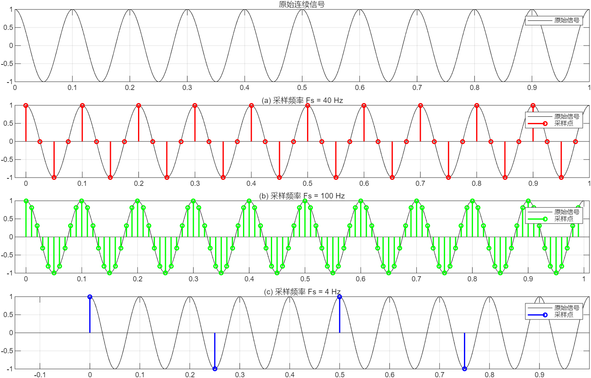
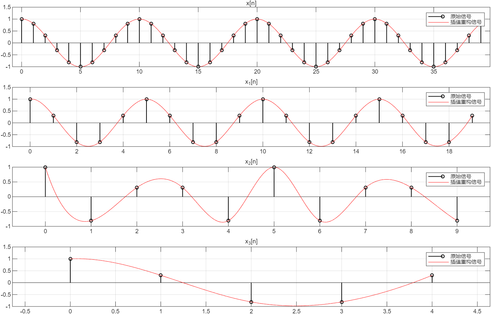
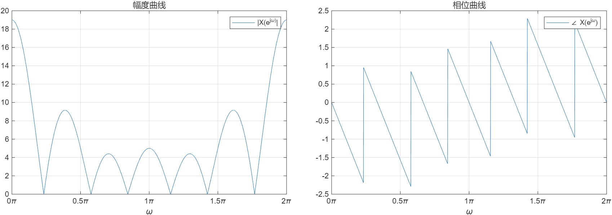
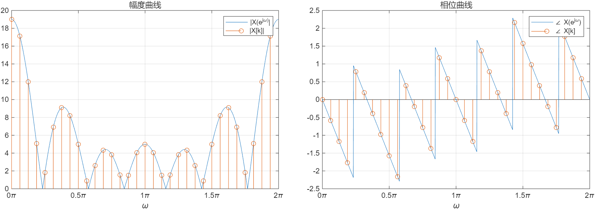
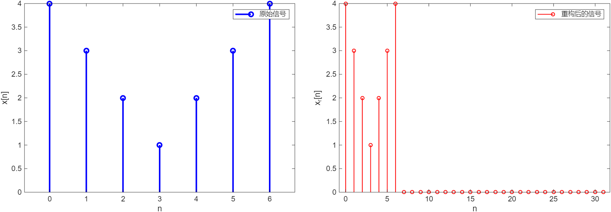
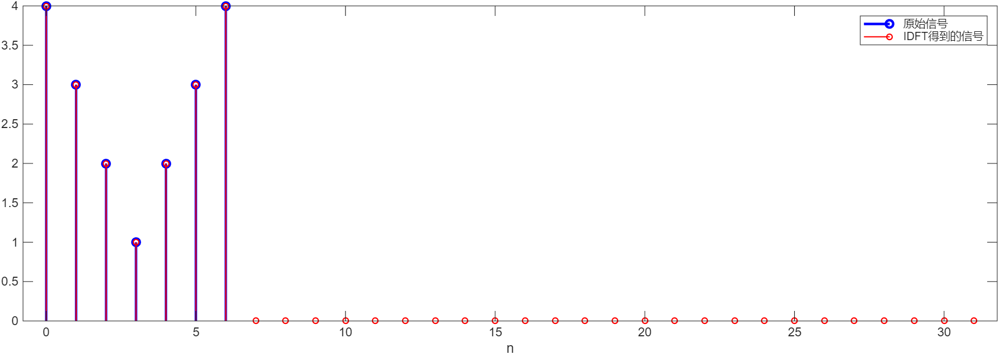
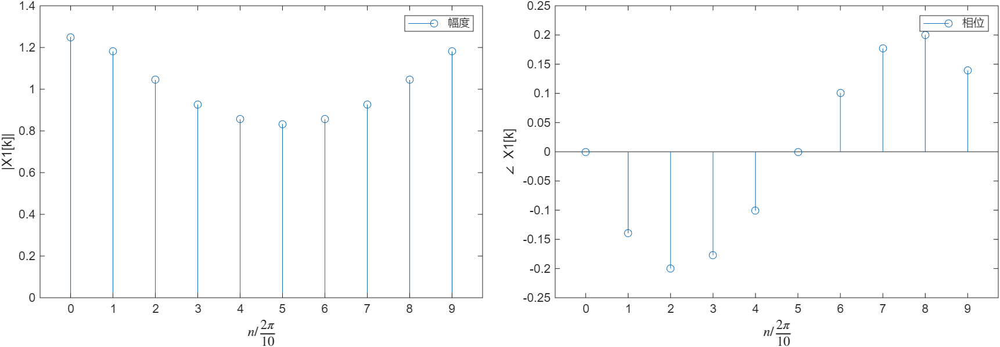
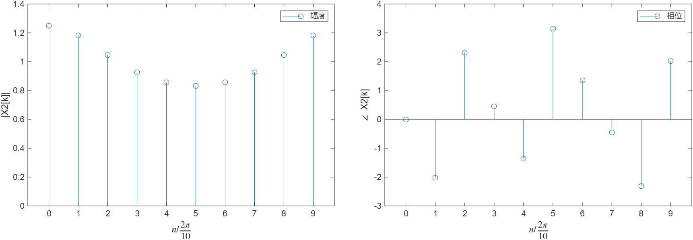
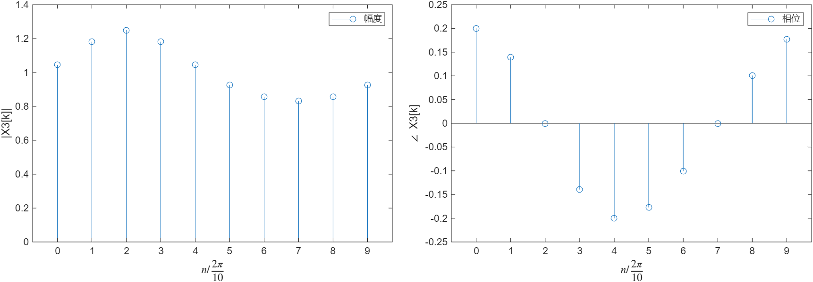

## 5-30
5-30 画出连续时间信号 \( x_c(t) = \cos(2\pi \times 10t) \)，\( 0 \leq t < 1\mathrm{s} \)，以及它的以下各采样信号的示意图。
（a）\( x[n] = x_c(t) \big|_{t=(1/40)n} \)；
（b）\( x[n] = x_c(t) \big|_{t=(1/100)n} \)；
（c）\( x[n] = x_c(t) \big|_{t=(1/4)n} \)。
原信号和三个采样信号的时域序列示意图都在图：

中，可以看到，随着采样频率的提升，采样信号对于原信号的复现越精确。
分析待补充...

## 5-32
5-32 画出序列 \( x[n] = \cos(0.2\pi n) \)，\( 0 \leq n < 40 \)，以及如下序列的示意图，并且用三次样条内插分别重构连续时间信号，比较各重构信号。
（a）\( x_1[n] = x[2n] \)；
（b）\( x_2[n] = x[4n] \)；
（c）\( x_3[n] = x[8n] \)。
（提示：可以调用的MATLAB函数有spline()，interp1()等）
原来的4个离散时间序列以及三次样条内插重构后的连续时间信号都在图：

中。
分析待补充...

## 6-41
6-41 已知序列 \( x[n] = \{4,3,2,1,2,3,4\} \)，\( n = \{0,\cdots,6\} \)。
（a）画出 \( x[n] \) 的傅里叶变换 \( X(\mathrm{e}^{\mathrm{j}\omega}) \) 的幅度和相位曲线；
（b）画出 \( x[n] \) 的32点DFT \( X[k] \) 的幅度和相位，要求与（a）画在一幅图上，验证频域取样关系；
（c）画出用 \( X[k] \) 经过32点IDFT得到的 \( x[n] \)，验证DFT和IDFT的唯一性。
（提示：可以调用的函数有fplot()、freqz()、fft()、ifft()等）

(a) 幅度曲线和相位曲线如图所示

原离散时间序列满足：$x[n] = \{4,3,2,1,2,3,4\}, n = \{0,\cdots,6\}$，因此$x[n]$关于$n=\frac{6}{2}=3$偶对称，故$X(e^{j\omega})$具有广义线性相位（相位曲线的斜率为$-\frac{6}{2}=-3$）。又因为$x[n+3]$是实偶序列，因此可以推知$|X()e^{j\omega}|$关于$k\pi$对称。

(b) $x[n]$的32点DFT以及DTFT均在图：

可见。可以很明显地看出，$x[n]$的32点DFT是其DTFT的频域取样，即：
$$X[k] = X(e^{j\omega}) \bigg|_{\omega = k\frac{2\pi}{N}}, k = 0,1,2,...,N-1$$

(c) \( X[k] \) 经过32点IDFT得到的序列见图：

该图中，左图是原序列$x[n]$，右图是经过32点DFT再经过32点IDFT后得到的序列$x'[n]$。可以发现，$x'[n]$就是$x[n]$的时域补零形式，
分析待补充...
在图：

这一点可以更清晰地看出

## 6-42
6-42 画出以下序列的10点DFT的幅度和相位曲线。
（a）\( x_1[n] = 0.2^n \)，\( 0 \leq n \leq 9 \)
（b）\( x_2[n] = x_1[((n-3))_{10}] \)，\( 0 \leq n \leq 9 \)
（c）\( x_3[n] = x_1[n]\mathrm{e}^{\mathrm{j}0.4\pi n} \)，\( 0 \leq n \leq 9 \)
（提示：可以调用的函数有circshift()和fft()等）

(a) $x_1[n]$的10点DFT的幅度曲线和相位曲线见：

(b) $x_2[n]$的10点DFT的幅度曲线和相位曲线见：

(c) $x_3[n]$的10点DFT的幅度曲线和相位曲线见：

分析待补充...（提示：循环移位性质）