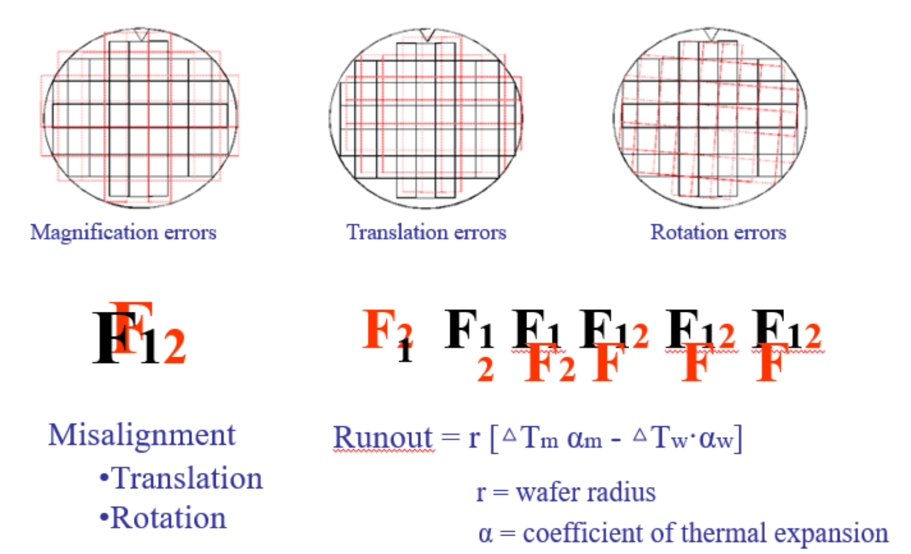
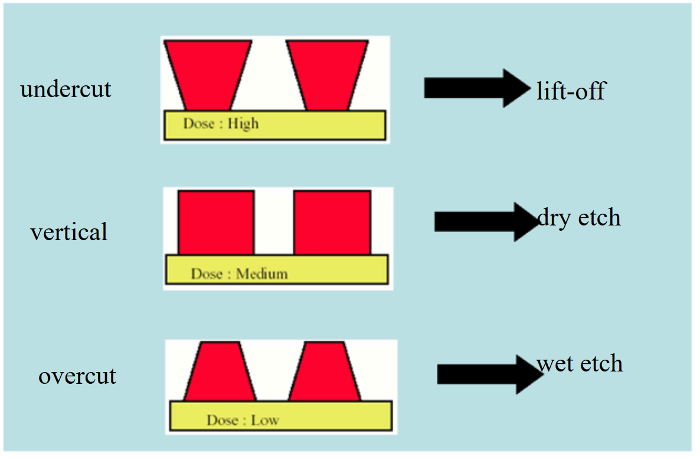

# 集成电路工艺技术——光刻工艺（第一部分）复习笔记（开卷考试专用）
## 说明
本笔记严格遵循课件章节结构，全面覆盖核心定义、公式、参数、原理及应用场景，关键术语、公式、参数均已加粗标注，支持Ctrl+F快速搜索定位；适用于复习及开卷考试查阅，完整还原课件重点内容。

---

## 1. 基本概念（Basic Concepts）
### 1.1 光刻的起源与本质
- 起源：1796年由Alois Senefelder发明，最初为“化学印刷”（石印术，lithos=石头，graphy=书写）
  - 原始原理：石灰石上用油性物质标记→酸蚀刻图像→阿拉伯树胶溶液附着于非油性区域→印刷时水附着树胶区，油性油墨转移至纸张
- 现代本质：集成电路平面制造的**核心图形转移工艺**，是信息从掩模到晶圆的传递过程（信息流向：设计掩模→空中图像→实像→潜像→光刻胶图像→器件层）
- 行业地位：芯片制造成本占比**>60%**，直接决定器件最小特征尺寸与性能

### 1.2 光刻技术的发展与关键指标
#### 1.2.1 技术代际与现状
- 终极研究方向：原子级操控（STM+UHV+低温环境），分辨率~0.3nm（单原子），但吞吐量极低（1原子/分钟），非通用工艺
- 量产主流技术：
  - 5nm EUV光刻（TSMC量产，如麒麟990 5G 7nm EUV芯片）
  - 193nm ArF浸没式光刻（22-45nm制程）
  - 技术演进：从平面CMOS到3D FinFET/纳米带结构，依赖光刻分辨率提升
- IBM SOI技术代际：130/180nm→90nm→65nm→45nm→32nm→22nm→14nm→10nm→7nm（EUV+第三代FinFET）

#### 1.2.2 核心性能指标（Key Lithography Metrics）
| 指标                | 定义与说明                                                                 |
|---------------------|--------------------------------------------------------------------------|
| 分辨率（Resolution） | 最小可分辨的特征尺寸，量产级光学光刻分辨率~λ/4（<30nm需借助分辨率增强技术），EUV光刻可达5nm |
| 对比度（Contrast）  | 区分曝光与未曝光区域的能力，直接影响图形质量                               |
| 吞吐量（Throughput） | 单位时间处理晶圆/图形的能力，量产设备可达100片/小时（300mm晶圆），≈10¹¹像素/秒       |
| 套刻精度（Placement Accuracy/Overlay） | 多层图形间的对准精度，影响器件电学连接可靠性                               |
| 临界尺寸控制（CD Control） | 特征尺寸的一致性（晶圆内、晶圆间），直接关联器件性能均匀性                   |

### 1.3 通用光刻工艺流程（Generic Lithographic Process）
1. 气相成底膜处理（增强光刻胶附着力）
2. 旋转涂胶（Spin-Coating）→ 光刻胶均匀覆盖晶圆
3. 软烘（Soft Bake）→ 蒸发溶剂，增强光刻胶稳定性
4. 对准与曝光（Alignment & Exposure）→ 掩模图形转移至光刻胶，形成潜像
5. 曝光后烘焙（Post-Exposure Bake, PEB）→ 强化潜像对比度（尤其化学放大光刻胶）
6. 显影（Development）→ 溶解未曝光/曝光区域，显现图形
7. 坚膜烘焙（Hard Bake）→ 提升光刻胶抗蚀刻能力
8. 显影后检查（Post-Development Inspection）→ 验证图形质量
9. 后续工艺：蚀刻（Etch）→ 光刻胶剥离（Resist Strip）

---

## 2. 光刻技术与辐射-物质相互作用（Lithography Technologies/Radiation-Matter Interaction）
### 2.1 光源系统（Sources）—— 光刻的“画笔”
#### 2.1.1 主流光源类型与参数
| 光源类型       | 波长（λ） | 适用制程       | 关键特点                     |
|----------------|-----------|----------------|------------------------------|
| Hg弧灯         | g线：436nm | 250-800nm      | 成本低，早期通用光源         |
| Hg弧灯         | h线：405nm | 250-800nm      | 波长略短于g线，分辨率稍优     |
| Hg弧灯         | i线：365nm | 250-800nm      | 深紫外光前主流，强度均匀性要求>几个百分点 |
| 准分子激光     | KrF：248nm | 130-180nm      | 深紫外（DUV），光刻胶需适配   |
| 准分子激光     | ArF：193nm | 65-130nm（步进式）/22-45nm（浸没式） | 目前量产核心光源之一         |
| 准分子激光     | F2：157nm  | -              | 极深紫外，应用受限           |
| 极紫外光（EUV） | 13.5nm    | 7-22nm         | 先进制程核心，无透镜（反射式光学） |

#### 2.1.2 光源关键要求
- 波长越短，分辨率越高（需搭配对应光刻胶与光学系统）
- 强度均匀性：收集区域内均匀性需优于几个百分点
- 定期校准：光源老化会影响曝光精度，需用光谱曝光计校准

### 2.2 曝光系统（Exposure Systems）—— 图形的“投射器”
#### 2.2.1 三类核心曝光方式对比
| 曝光方式       | 结构原理                                                                 | 分辨率公式/关键参数                | 优缺点                     |
|----------------|--------------------------------------------------------------------------|-----------------------------------|----------------------------|
| 接触式（Contact） | 掩模与光刻胶直接接触                                                     | -                                 | 优点：结构简单、成本低；缺点：掩模易污染/损伤，分辨率有限 |
| 接近式（Proximity） | 掩模与光刻胶间存在微小间隙（g），依赖菲涅耳衍射                           | 最小分辨尺寸 \(W_{min} \approx \sqrt{\lambda g}\)   适用间隙范围 \(\lambda < g < \frac{W^2}{\lambda}\) | 优点：避免掩模直接接触；缺点：分辨率受间隙影响大（g越小分辨率越好） |
| 投影式（Projection） | 通过透镜系统将掩模图形缩小投射至晶圆（常见缩小比例4X/5X/10X）             | 分辨率 \(d_{min} \propto \frac{\lambda}{NA}\)（NA为数值孔径） | 优点：高分辨率（深紫外适配）、掩模受保护；缺点：光学系统复杂、成本极高 |

#### 2.2.2 投影式曝光的主流设备
- 步进式光刻机（Stepper）：逐场曝光，图形缩小比例固定
- 步进扫描光刻机（Step & Scan）：掩模与晶圆同步扫描+步进移动，兼顾分辨率与吞吐量（ASML主流机型）
- 准分子激光步进/扫描机特点：脉冲光源（20ns/脉冲，重复频率数kHz，每幅图形需~50个脉冲）

### 2.3 不同光刻技术对比（Lithography Technologies）
#### 2.3.1 技术性能对比表
| 光刻技术               | 分辨率（nm） | 套刻精度（nm） | 吞吐量（特征/秒） | 成本（$）          | 核心优缺点                                                                 |
|------------------------|--------------|----------------|-------------------|--------------------|--------------------------------------------------------------------------|
| 光学光刻（Optical）    | 50           | 15             | 10¹⁰              | 10⁷                | 优点：行业标准、吞吐量高；缺点：受衍射限制，小尺寸需分辨率增强技术         |
| X射线光刻（X-ray）     | 30           | 15             | 10¹⁰              | 10⁸                | 优点：焦深大、工艺简单；缺点：光源昂贵、掩模适配性差                     |
| EUV光刻                | ~25          | 10             | 10¹⁰              | 10⁸                | 优点：分辨率高（适配7-22nm）；缺点：设备成本极高、依赖化学放大光刻胶     |
| 电子束直写（E-beam Direct-write） | <10      | 10             | 10⁴               | 10⁵-10⁶            | 优点：分辨率极高；缺点：吞吐量极低，适用于掩模制造而非量产               |
| 聚焦离子束（Focused Ion Beam） | ~10    | 10             | 10¹-10²           | 10⁶                | 优点：分辨率高；缺点：吞吐量低、易造成晶圆损伤                           |
| 纳米压印（Nanoimprint） | <10          | >100           | 10¹²              | 10³-10⁶            | 优点：分辨率高、吞吐量高；缺点：套刻精度差、掩模易磨损                   |
| 微接触印刷（Micro-contact Printing） | ~50    | 1000           | 10¹²              | 10²-10³            | 优点：成本极低；缺点：分辨率低、套刻精度极差                             |

#### 2.3.2 各技术分辨率限制因素
| 光刻技术   | 核心分辨率限制因素                     |
|------------|----------------------------------------|
| 光学光刻   | 衍射效应（Diffraction）                 |
| EUV光刻    | 二次电子效应（Secondary e.）           |
| X射线光刻  | 半影模糊（Penumbral blur）、二次电子效应 |
| 离子束光刻 | 探针尺寸（Probe size）、散射效应       |
| 纳米压印   | 掩模制造精度（依赖电子束光刻）         |

#### 2.3.3 分辨率与吞吐量权衡关系
- 核心规律：分辨率越高，吞吐量通常越低（如STM原子操控分辨率0.3nm，但吞吐量仅0.017像素/秒）
- 拟合公式：\(R=23T_0^{-0.2}\)（R为分辨率，\(T_0\)为面吞吐量）

---

## 3. 光刻材料（Lithographic Materials）
### 3.1 掩模（Mask）—— 图形的“模板”
#### 3.1.1 掩模组成与材料要求
| 组成部分   | 核心要求                                                                 | 常用材料                     |
|------------|--------------------------------------------------------------------------|------------------------------|
| 基板（Substrate） | 高透光性、低热膨胀系数、高平整度、低非线性变形                           | 石英（Quartz）、熔融二氧化硅、BSC |
| 吸收层（Absorber） | 曝光波长下无透光性、与基板附着力强、耐久性好                             | 铬（Chrome）、乳胶、Fe₂O₃     |
| 散射层（Scatterer） | 优化光场分布，提升图形对比度                                             | 专用光学涂层                 |

#### 3.1.2 掩模极性（Mask Polarity）
| 极性       | 特点                                                                 | 优势                     |
|------------|----------------------------------------------------------------------|--------------------------|
| 明场（Light Field） | 掩模上图形区域为透光区，背景为遮光区                                   | 图形成像直观             |
| 暗场（Dark Field） | 掩模上图形区域为遮光区，背景为透光区                                   | 相邻/背景曝光量少、缺陷影响小 |

### 3.2 光刻胶（Resist）—— 图形的“感光载体”
#### 3.2.1 光刻胶组成与功能
| 组成部分       | 功能描述                                                                 |
|----------------|--------------------------------------------------------------------------|
| 基质材料（Matrix/Resin） | 粘结剂，附着于基板，耐化学/等离子体蚀刻，未曝光时溶解速率稳定             |
| 敏化剂（Sensitizer/Photoactive Compound, PAC） | 光活性物质，未曝光时抑制溶解，曝光后转化为溶解促进剂（溶解度差异达100:1） |
| 溶剂（Solvent） | 使光刻胶呈液态，便于旋转涂胶，浓度决定膜厚                               |

#### 3.2.1 光刻胶类型与特性
| 类型                 | 作用机制                                                                 | 关键特征                     |
|----------------------|--------------------------------------------------------------------------|------------------------------|
| 负性光刻胶（Negative） | 曝光后发生交联反应，不溶于显影液，图形为曝光区域                         | 易膨胀、分辨率较差，但附着力强 |
| 正性光刻胶（Positive） | 曝光后发生链断裂反应，溶于显影液，图形为未曝光区域                       | 分辨率高，分为线型酚醛清漆/重氮盐型、链断裂型等 |
| 化学放大光刻胶（Chemically Amplified） | 曝光产生酸催化剂，经PEB放大反应，灵敏度高                               | 适配EUV/深紫外光刻，量产主流 |
| 自显影光刻胶（Self-developing） | 曝光后无需额外显影步骤，直接形成图形                                     | 工艺简化，适用特定场景       |

#### 3.2.2 光刻胶关键性能要求
1. 对比度（Contrast）：区分曝光与未曝光区域的能力，公式：
\[
\gamma=\left[log \left(\frac{D_f}{D_0}\right)\right]^{-1}
\]
   - \(D_0\)：初始溶解剂量，\(D_f\)：100%溶解剂量，\(\gamma\)越大对比度越好（理想状态\(D_f \approx D_0\)）
2. 分辨率（Resolution）：受聚合物尺寸、扩散效应、膜厚影响
3. 灵敏度（Sensitivity）：对辐射的响应能力，强吸收→高灵敏度，但通常与分辨率负相关
4. 抗腐蚀性：耐受酸、碱、等离子体、离子轰击、反应离子刻蚀（RIE）
5. 其他：基板附着力强、均匀性好、易剥离、低缺陷密度、温度稳定性好、保质期长

#### 3.2.3 光刻胶涂胶与膜厚控制
- 涂胶方式：旋转涂胶（Spincoat），核心影响因素：粘度、旋转速度、表面张力、环境氛围
- 膜厚公式：
\[
T=\frac{K C^{\beta} \eta^{\gamma}}{\omega^{\alpha}}
\]
  - 变量含义：\(K\)=校准常数，\(C\)=聚合物浓度（g/ml），\(\eta\)=特性粘度，\(\omega\)=旋转速度（rpm），\(\beta、\gamma、\alpha\)=经验系数
- 附着力优化：通过底涂剂（Primer）将基板亲水表面转化为疏水表面，提升光刻胶附着

---

## 4. 光学光刻关键因素（Key Factors in Optical Lithography）
### 4.1 分辨率（Resolution）—— 光刻的核心极限
#### 4.1.1 瑞利判据（Rayleigh Criterion）
- 定义：两个点光源的艾里斑中心最大值与另一个艾里斑第一最小值重合时，恰能分辨
- 公式（Fraunhofer远场投影）：
\[
R=0.61 \frac{\lambda}{NA}
\]
  - 数值孔径（Numerical Aperture, NA）：\(NA=n sin\alpha\)（\(n\)为介质折射率，\(\alpha\)为物镜最大半孔径角）
- 核心规律：波长\(\lambda\)越短、NA越大，分辨率越高

#### 4.1.2 分辨率增强技术（Resolution Enhancement Techniques, RET）
- 适用场景：当特征尺寸显著小于光源波长时（目前主流量产场景）
- 主流技术：离轴照明（Off-axis illumination）、相移掩模（Phase shift mask）、光学邻近校正（Optical Proximity Correction, OPC）

### 4.2 对比度（Contrast）—— 图形质量的保障
- 定义：光强分布的调制能力，公式：
\[
Contrast = \frac{I_{max}-I_{min}}{I_{max}+I_{min}}
\]
  - 本质：图形的调制传输函数（MTF），无衍射时MTF=1，有衍射时MTF<1
- 影响因素：
  - 图形尺寸：尺寸越小，MTF越小
  - 光源波长：波长越短，MTF越大
  - 光刻胶响应：化学放大、PEB工艺可提升对比度

### 4.3 临界尺寸控制（CD Control）
- **临界尺寸（Critical Dimension, CD）：器件关键特征尺寸（如线宽），直接影响器件电学性能**
- 影响因素：
  1. 曝光均匀性（设备依赖）
  2. 照明条件（图形依赖，如邻近效应）
  3. 光刻胶特性（膜厚、成分）
  4. 工艺参数（显影浓度/时间/温度、烘焙温度、曝光剂量）
  5. 图形转移过程（蚀刻工艺匹配度）

### 4.4 吞吐量（Throughput）—— 量产效率的关键
- **定义：单位时间内处理的图形/晶圆数量**，核心影响因素：
  1. 像素曝光速率（光源脉冲频率flash rate、每脉冲像素数pixels per flash）
  2. 光刻胶灵敏度（灵敏度越高，所需曝光剂量越低，效率越高）
- 量产目标：300mm晶圆吞吐量≥100片/小时（光学光刻）

### 4.5 套刻精度（Overlay/Placement Accuracy）
- **定义：多层图形间的对准精度，直接影响器件互连可靠性**
- 对准原理：**通过晶圆与掩模上的对准标记（Marks）实现精准定位**
- 误差来源：
  - **放大**误差（Magnification errors）
  - **平移**误差（Translation errors）
  - **旋转**误差（Rotation errors）
  - **热膨胀**误差：\(Runout =r\left[\Delta T_m \alpha_{m}-\Delta T_w \cdot \alpha_{w}\right]\)（\(r\)为晶圆半径，\(\alpha\)为热膨胀系数，\(\Delta T\)为温度变化）
    

### 4.6 焦深（Depth of Focus, DoF）
- 定义：**保持成像清晰的轴向距离范围，是光学系统的关键参数**
- 重要性：焦深越大，对晶圆平整度、光刻胶膜厚均匀性的容忍度越高，减少图形畸变

### 4.7 光刻胶图形轮廓（Resist Profiles）
- **由曝光(Exposure)剂量与显影工艺(Development)决定，影响后续蚀刻效果**：
  - 高剂量：易出现底切（Undercut），适配剥离工艺（Lift-off）
  - 中剂量：垂直轮廓（Vertical），适配干法蚀刻（Dry Etch）
  - 低剂量：易出现过切（Overcut），适配湿法蚀刻（Wet Etch）
  
- 常见问题：图形倒塌（Pattern Collapse）、残留（Scumming）、表面污染（如DUV光刻胶受碱污染）

---

## 5. 总结（Summary）
### 5.1 核心框架
1. 本质：光刻是**图形转移+信息传递**的核心工艺，成本占比超60%
2. 核心三要素：光源（波长决定分辨率上限）、曝光系统（图形投射方式）、光刻材料（掩模+光刻胶，图形承载与转移）
3. 关键权衡：分辨率与吞吐量、灵敏度与分辨率、成本与性能
4. 量产主流：193nm ArF浸没式（22-45nm）、EUV（7-22nm），依赖分辨率增强技术与化学放大光刻胶

### 5.2 必记公式汇总（快速检索）
| 公式用途               | 公式                                                                 |
|------------------------|----------------------------------------------------------------------|
| 接近式光刻最小分辨尺寸 | \(W_{min} \approx \sqrt{\lambda g}\)                                  |
| 投影式光刻分辨率（比例） | \(d_{min} \propto \frac{\lambda}{NA}\)                                |
| 瑞利判据（光学分辨率） | \(R=0.61 \frac{\lambda}{NA}\)（\(NA=n sin\alpha\)）                   |
| 光刻胶对比度           | \(\gamma=\left[log \left(\frac{D_f}{D_0}\right)\right]^{-1}\)          |
| 光刻胶膜厚             | \(T=\frac{K C^{\beta} \eta^{\gamma}}{\omega^{\alpha}}\)                |
| 光强对比度             | \(Contrast = \frac{I_{max}-I_{min}}{I_{max}+I_{min}}\)                |
| 热膨胀对准误差         | \(Runout =r\left[\Delta Tm \alpha_{m}-\Delta Tw \cdot \alpha_{w}\right]\) |

### 5.3 关键参数速查
| 参数                 | 典型值/范围                |
|----------------------|----------------------------|
| 主流光源波长         | 365nm（i线）、248nm（KrF）、193nm（ArF）、13.5nm（EUV） |
| 量产分辨率           | 5nm（EUV）- 800nm（g线）  |
| 量产吞吐量           | ≥100片/小时（300mm晶圆）   |
| 光刻胶对比度         | 理想状态\(\gamma>2\)（如课件示例\(\gamma=2.3\)） |
| 投影式缩小比例       | 4X/5X/10X                  |
| 接近式光刻间隙       | 2-50μm（\(\lambda < g < \frac{W^2}{\lambda}\)） |