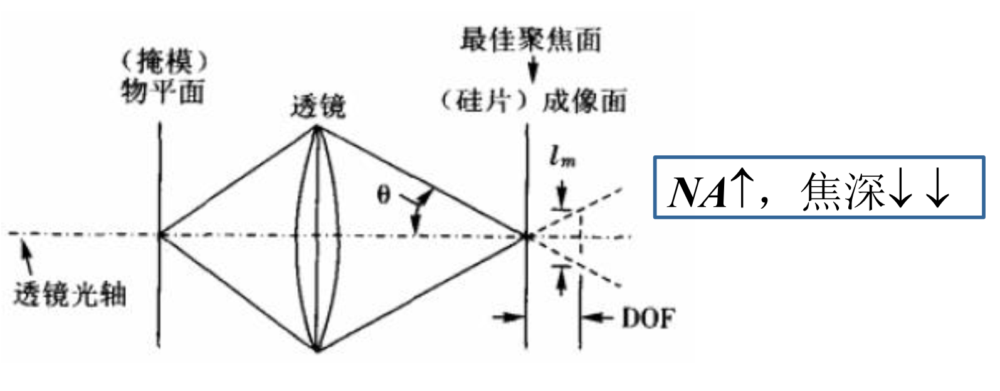

# 集成电路工艺技术——光刻工艺（第二部分）复习笔记（开卷考试专用）
## 说明
本笔记聚焦课件核心模块（分辨率限制、分辨率增强技术、EUV光刻），延续结构化整理风格，关键术语、公式、参数均加粗标注，支持Ctrl+F快速搜索定位；覆盖技术原理、核心公式、工艺细节及应用场景，适用于复习及开卷考试查阅。

---

## 1. 分辨率限制（Resolution Limits）
### 1.1 核心限制因素：衍射（Diffraction）
- 本质：光刻的根本分辨率瓶颈，光通过掩模孔径后发生衍射，导致 aerial image（空中图像）模糊，无法形成理想锐利图形
- 适用场景：远场投影光刻（Fraunhofer衍射）、近场接近式光刻（Fresnel衍射）均受衍射影响

### 1.2 关键参数与核心公式
#### 1.2.1 数值孔径（Numerical Aperture, NA）
- 定义：描述光学系统收集光线的能力，直接关联分辨率与焦深
- 公式：\(NA = n \cdot sin\theta\)
  - 变量含义：\(n\)为光传播介质的折射率（空气n=1，水n=1.44），\(\theta\)为物镜最大半孔径角
- 规律：NA越大，分辨率越高，但焦深越小（存在权衡关系）

#### 1.2.2 瑞利判据（Rayleigh Criterion）
- 定义：判断两个点光源能否分辨的标准——一个点光源的艾里斑中心与另一个的第一极小值重合时，恰能分辨
- 分辨率公式（圆形孔径，远场）：
\[
R = \frac{0.61\lambda}{NA} \quad \text{或} \quad \ell_{min} = k_1 \cdot \frac{\lambda}{NA}
\]
  - **变量含义：\(\lambda\)为光源波长，\(k_1\)为工艺因子（取决于光学系统、掩模、光刻胶及工艺窗口，通常0.25-0.8）**
  - **核心规律：\(\lambda\)越短、NA越大、\(k_1\)越小，最小分辨尺寸\(\ell_{min}\)越小（分辨率越高）**

#### 1.2.3 焦深（Depth of Focus, DOF）
- 定义：保持成像清晰的轴向距离范围，决定光刻对晶圆平整度、光刻胶膜厚均匀性的容忍度
- 公式：
\[
DOF = \pm k_2 \cdot \frac{\lambda}{(NA)^2}
\]
  - 变量含义：\(k_2\)为焦深因子（通常0.5-1）
  - 关键权衡：NA增大时，DOF显著减小（如NA≈1时，DOF≈λ/2），需通过工艺优化（如薄光刻胶）补偿

### 1.3 不同曝光方式的分辨率特点
| 曝光方式       | 分辨率公式/核心规律                          | 实际分辨率范围       | 关键限制因素                     |
|----------------|---------------------------------------------|----------------------|----------------------------------|
| 接触式（Contact） | 理想分辨率<<1μm（近场无衍射限制）            | 实际>1μm             | 掩模与晶圆污染/损伤、平整度要求极高 |
| 接近式（Proximity） | 最小分辨尺寸\(\ell_{min} \approx \sqrt{\lambda g}\)（g为掩模-晶圆间隙） | 可见光下~2μm，X射线更优 | 间隙g增大导致分辨率下降          |
| 投影式（Projection） | \(\ell_{min} = k_1 \cdot \frac{\lambda}{NA}\) | **深紫外下可达45nm，EUV下5nm** | 衍射效应、NA上限、工艺因子k1     |

---

## 2. 分辨率增强技术（Resolution Enhancement Techniques, RET）
### 2.1 核心优化方向
RET的本质是通过技术手段调整瑞利公式中的三个关键变量：**减小波长λ、增大数值孔径NA、减小工艺因子k1**，从而突破衍射限制，提升分辨率。

### 2.2 方向1：减小光源波长（λ）—— 从紫外到极紫外
#### 2.2.1 光源演进与参数对应
| 光源类型       | 波长（nm） | 介质折射率n | 适用制程（μm） | 关键特点                     |
|----------------|-----------|-------------|----------------|------------------------------|
| Hg弧灯（g线）  | 436       | 1（空气）   | 0.50           | 早期基础光源，成本低         |
| Hg弧灯（i线）  | 365       | 1（空气）   | 0.35-0.25      | 深紫外前主流，强度均匀性要求高 |
| 准分子激光（KrF） | 248     | 1（空气）   | 0.25-0.13      | 深紫外（DUV），适配早期先进制程 |
| 准分子激光（ArF） | 193     | 1（空气）/1.44（水） | 0.09-0.045（干法）/22-32（浸没式） | 目前量产核心光源，可结合浸没式扩展 |
| 准分子激光（F2） | 157     | 1（空气）   | -              | 极紫外（VUV），无保护膜，应用受限 |
| EUV            | 13.5      | 1（真空）   | 7-22           | 先进制程核心，反射式光学       |

#### 2.2.2 技术挑战
- **波长越短，光学材料兼容性越差**（如F2光刻需CaF2透镜）
- **光刻胶需适配短波长**：需增强吸收灵敏度，同时保持高分辨率
- **成本剧增**：短波长光源（如EUV）的设备复杂度与价格远超传统光源

### 2.3 方向2：增大数值孔径（NA）—— 浸没式光刻（Immersion Lithography）
#### 2.3.1 核心原理
- **传统干法光刻：光在空气中传播（n=1），NA=sinθ（最大NA<1）
- 浸没式光刻：在物镜与晶圆间填充高折射率液体（如水，n=1.44），突破NA<1的限制**
  - 公式升级：\(NA_{浸没} = n \cdot sin\theta\)（n>1，NA可提升至1.3以上）
  - 分辨率提升：\(\ell_{min} \propto 1/NA\)，NA增大则最小线宽减小（如ArF+水，193nm波长下，NA=0.93→1.3，\(\ell_{min}\)从62nm降至45nm）

#### 2.3.2 关键参数与优势
- 典型液体：**去离子水（n=1.44，193nm波长下透光性好）**
- 焦深变化：DOF（浸没）/DOF（干法）≈n，焦深同步提升，降低对晶圆平整度的要求
- 量产应用：193nm浸没式光刻结合双重曝光，实现32nm→22nm→14nm制程延伸（如Intel Core i7、台积电14nm）

#### 2.3.3 技术挑战
- 液体控制：需避免气泡、温度波动，保证液体均匀覆盖
- 光学系统：需适配液体环境，镜头成本显著增加
- 污染风险：液体可能携带杂质，影响光刻胶性能

### 2.4 方向3：减小工艺因子（k1）—— 波前工程技术
#### 2.4.1 相移掩模（Phase Shift Mask, PSM）
- **核心原理：通过相邻透明区的180°相位差，利用光的干涉减弱图形边缘衍射模糊，提升对比度**
- 类型与特点：
  - 衰减型PSM：部分透光材料实现相位偏移，工艺简单
  - 交替型PSM：相邻区域相位交替180°，对比度提升显著，适配密集图形
- 应用效果：193nm DUV光刻结合PSM，可实现60nm线宽图形

#### 2.4.2 光学邻近校正（Optical Proximity Correction, OPC）
- **核心问题：衍射导致图形畸变（如角圆化、线缩短、CD偏差）**
- **原理：通过CAD修改掩模图形（如添加“锤头”“拐点校正”），补偿衍射变形，使最终光刻胶图形符合设计要求**
- 发展历程：从规则化OPC（基于修正表）到模型化OPC（迭代优化至公差范围内）

#### 2.4.3 亚分辨率辅助图形（Sub-Resolution Assist Features, SRAFs）
- 原理：**在主图形周围添加不打印的微小辅助图形，改善主图形的光场分布**
- 优势：提升**孤立图形与密集图形的尺寸均匀性，增大焦深**
- 关键要求：辅助图形尺寸小于分辨率极限，确保不被光刻胶显影

#### 2.4.4 双重曝光/多重曝光（Double Patterning/Multiple Patterning）
- 核心原理：将一个精细图形（低k1）拆分为两个较粗图形（高k1），分两次曝光+蚀刻，最终叠加形成目标图形
- 工艺类型：
  - 双重曝光+双重蚀刻：两次光刻+两次蚀刻，工艺复杂但精度高
  - 光刻-蚀刻-光刻-蚀刻（LELE）：主流量产方案
- 应用效果：k1从0.3降至0.15，实现32nm→14nm制程延伸

#### 2.4.5 其他技术
- 离轴照明（Off-Axis Illumination, OAI）：改变照明角度，增强高空间频率图形的光强，提升分辨率
- 干涉光刻（Interferometric Lithography）：无掩模，利用两束平面波干涉形成周期性图形，分辨率仅依赖λ和角度，适配规则结构（如光栅）

---

## 3. EUV光刻（Extreme Ultraviolet Lithography）
### 3.1 核心定位与关键参数
- 本质：波长λ=13.5nm的极紫外光刻，是7-22nm先进制程的核心技术（如台积电5nm、7nm EUV量产）
- 核心公式：与光学光刻一致，但λ显著减小
  - 分辨率：\(\ell_{min} = k_1 \cdot \frac{\lambda}{NA}\)（λ=13.5nm，NA可达0.55，\(\ell_{min}\)低至8nm）
  - 焦深：\(DOF = \pm k_2 \cdot \frac{\lambda}{(NA)^2}\)
  - **相干系数**：\(\sigma = \frac{NA_{cond}}{NA_{obj}}\)（ condenser 与物镜的NA比值）

### 3.2 核心结构与原理
#### 3.2.1 光学系统：反射式设计（无透镜）
- 原因：EUV光子能量高，无法透过传统光学玻璃，需依赖反射镜
- 关键组件：Mo/Si多层反射镜（50层以上，d=6.7nm），反射率≈70%（13.5nm波长）
  - 投影物镜：由4-6片非球面反射镜组成，要求波前误差<0.2nm，表面粗糙度<50pm
  - 照明系统： condenser 反射镜，将光源均匀投射至掩模

#### 3.2.2 掩模结构（反射式掩模）
| 组成部分         | 材料与要求                                                                 |
|------------------|--------------------------------------------------------------------------|
| 基板（Substrate） | 低热膨胀材料（LTEM），如ULE、Zerodur，尺寸6英寸×1/4英寸，保证平整度       |
| 多层涂层（Multilayer） | Mo/Si交替层（d=6.7nm），30nm SiO2保护层，提供EUV反射率                   |
| 吸收层（Absorber） | TaN或Cr，厚度50-70nm，遮挡EUV，形成图形，TaN比Cr具有更好的CD控制和 inspection 对比度 |
| 缓冲层（Buffer） | Ru，厚度50nm，提升吸收层附着力                                           |

#### 3.2.3 光源系统
- 类型：
  - 激光等离子体光源（LPP）：激光轰击锡滴，产生EUV等离子体
  - 放电等离子体光源（DPP）：高压放电激发Xe或Sn等离子体
- 关键要求：中间焦点功率>180W，转换效率高，使用寿命长

#### 3.2.4 曝光方式：步进扫描（Step & Scan）
- 掩模与晶圆同步扫描，投影缩小比例4:1，扫描视场24mm×1.5mm

### 3.3 技术挑战
1. 光源功率：需达到量产要求（>180W），同时控制设备发热
2. 掩模缺陷：无保护膜（pellicle），易受污染，需实现“零缺陷”掩模制造
3. 光刻胶性能：要求3σ线宽粗糙度（LWR）<1.5nm，灵敏度<10mJ/cm²，分辨率<20nm半节距
4. 光学污染：反射镜易被碳沉积污染，需保证5年以上使用寿命
5. 成本控制：设备价格超1亿美元，需通过高吞吐量降低单位成本

---

## 4. 总结（Summary）
### 4.1 核心框架
1. 分辨率瓶颈：衍射是根本限制，由瑞利公式\(\ell_{min} = k_1 \lambda / NA\)决定
2. RET技术逻辑：通过“减λ、增NA、降k1”三方向突破瓶颈，其中浸没式+OPC+双重曝光是成熟量产方案，EUV是先进制程核心
3. EUV核心优势：λ=13.5nm，无需复杂RET即可实现小尺寸，但其反射式光学、掩模、光源是技术关键

### 4.2 必记公式汇总（快速检索）
| 公式用途               | 公式                                                                 |
|------------------------|----------------------------------------------------------------------|
| 数值孔径               | \(NA = n \cdot sin\theta\)                                            |
| 最小分辨尺寸（瑞利判据） | \(\ell_{min} = k_1 \cdot \frac{\lambda}{NA}\)                          |
| 焦深                   | \(DOF = \pm k_2 \cdot \frac{\lambda}{(NA)^2}\)                          |
| 接近式光刻分辨率       | \(\ell_{min} \approx \sqrt{\lambda g}\)                                |
| 相干系数（EUV）        | \(\sigma = \frac{NA_{cond}}{NA_{obj}}\)                                |
| 光子能量与波长关系     | $h \omega \lambda = hc = 1239.842 \text{eV}\cdot\text{nm}$    |

### 4.3 关键参数速查
| 参数                 | 典型值/范围                |
|----------------------|----------------------------|
| 主流光源波长         | 365nm（i线）、248nm（KrF）、193nm（ArF）、13.5nm（EUV） |
| 工艺因子k1           | 0.25-0.8（先进制程k1<0.3） |
| 焦深因子k2           | 0.5-1                      |
| 浸没式液体折射率     | 水n=1.44                   |
| EUV反射镜反射率      | ~70%（13.5nm）             |
| EUV掩模多层涂层      | Mo/Si交替层（40-50层）     |
| 量产EUV分辨率        | 5-22nm                     |

---

要不要我帮你整理一份**分辨率增强技术（RET）对比表**，包含技术原理、关键参数、适用制程及优缺点，方便你快速对比记忆？